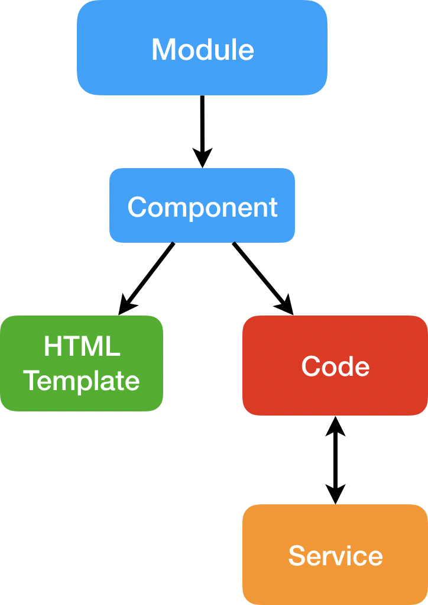
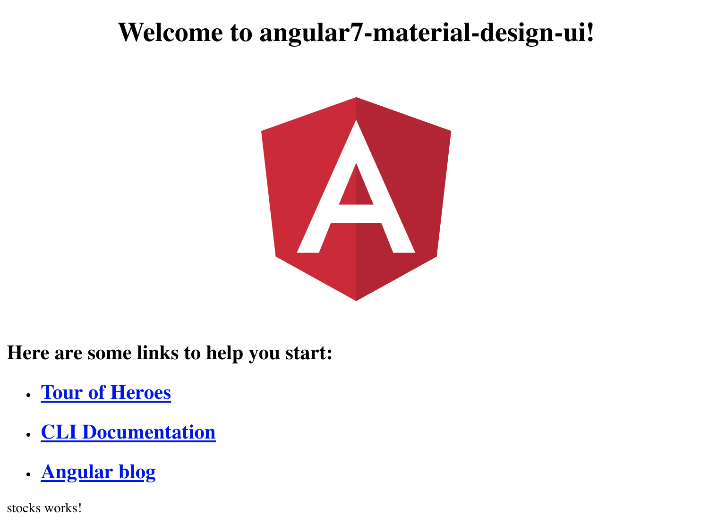
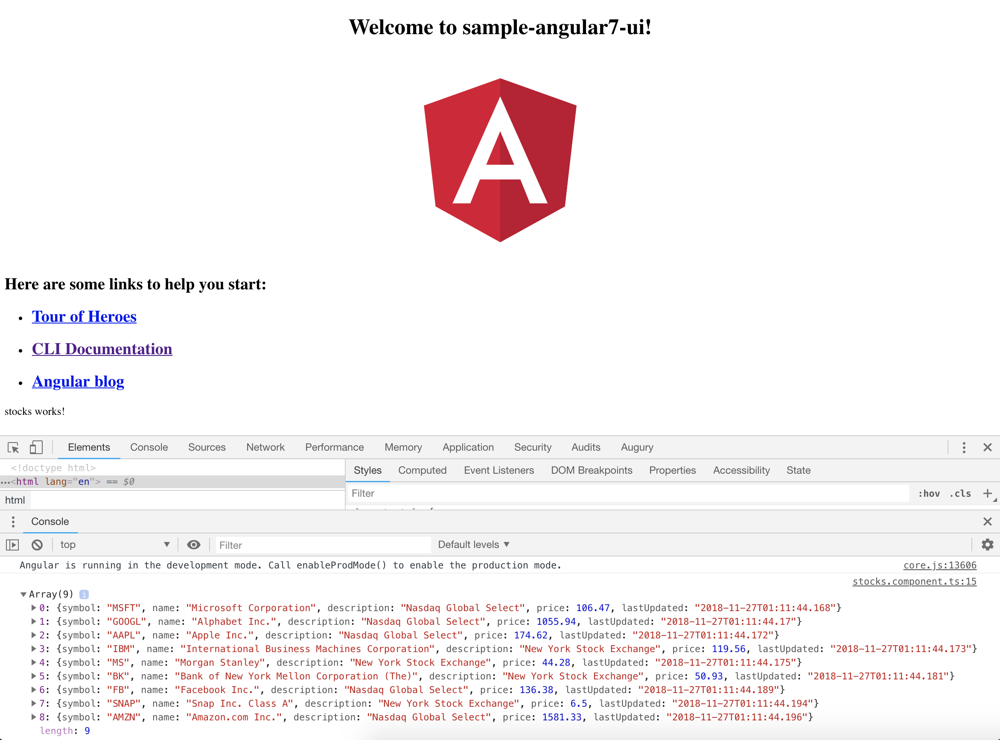
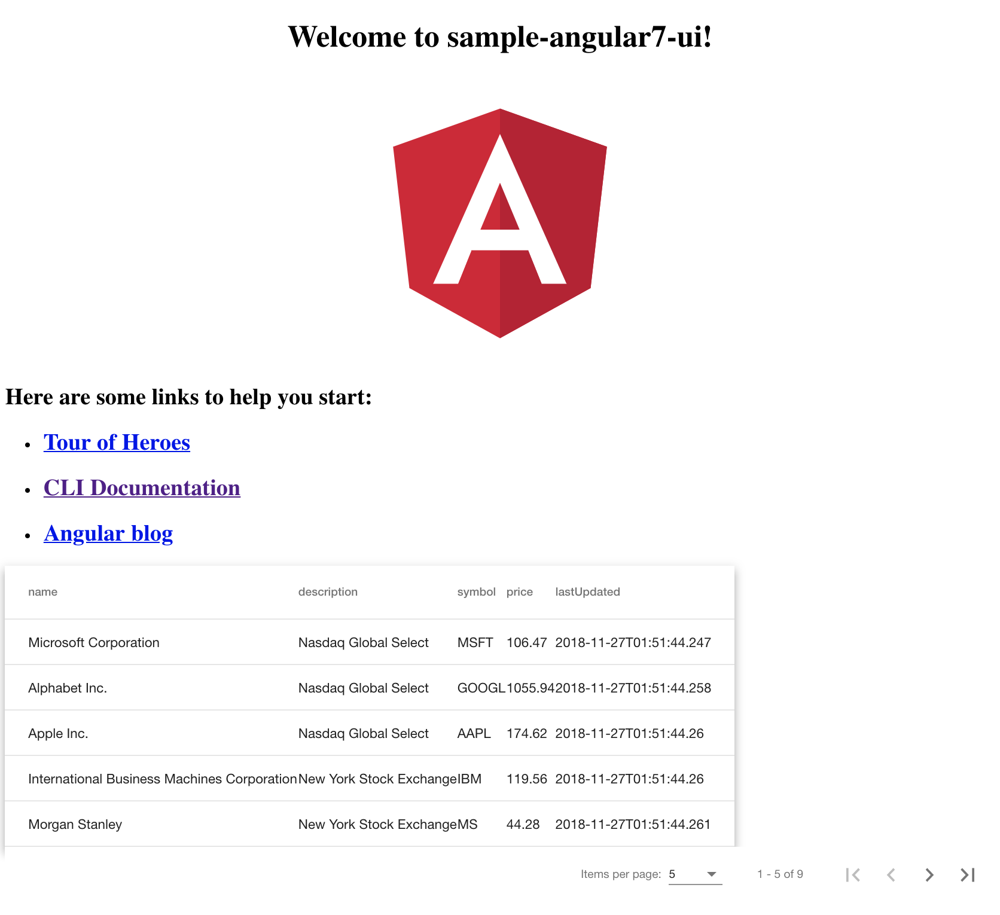
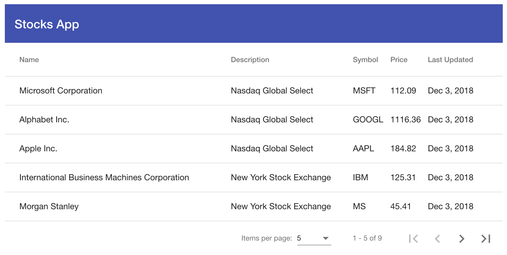

author: Zarin Lokhandwala
summary: How to Create an Angular 7 UI with Material Design
id: angular-ui

# How to Create an Angular7 UI with Material Design
<!-- ---------------------------------------------------------------------------------------------------------------- -->
## Overview
Duration: 15

### What you'll learn
- How to display data from an API onto a table 
- How to proxy data from your local backend server (i.e. Java API) to your frontend (i.e. Angular)

### Prerequisties 
- Run the backend found here: [sample-springboot-api](https://github.com/zarinlo/sample-springboot-api)

### What you'll need
- Install [Git and Git Bash](https://git-scm.com/downloads)
- Install [nvm](https://medium.com/@richardkall/installing-node-js-using-node-version-manager-nvm-c21546a613bc) (Node Version Manager)
- Install Node.js and npm via nvm
- Install [Angular CLI](https://github.com/angular/angular-cli/wiki)
- Install any IDE (i.e. [Visual Studio Code](https://code.visualstudio.com/))

### What are these tools?
- Node Version Manager or [nvm](https://github.com/creationix/nvm/blob/master/README.md) is a tool that allows you to manage multiple versions of Node.js on the same machine.
- [Node.js](https://nodejs.org/en/about/) is a JavaScript runtime environment and [npm](https://www.npmjs.com/) which is the node package manager. 
- Angular CLI is a command line interface that easily scaffolds bare-minimum Angular apps. 
- [Angular Material](https://material.angular.io), which will be introduced later, is a UI design framework for Angular apps. 
- [Bootstrap](https://getbootstrap.com/), which will be introduced later as well, is another front-end framework for designing websites and web applications.

<!-- ---------------------------------------------------------------------------------------------------------------- -->
## Setup Your Environment
Duration: 3

We will be creating a new Angular CLI application. But before we begin, double check you have installed compatible versions of the tools mentioned in the previous step. 

### nvm 

```bash
$ nvm --version
0.33.11
```

### Node.js 

```bash
$ node --version
v10.13.0
```

### npm

```bash
$ npm --version
6.4.1
```

### Angular CLI 

```bash
$ ng --version                           
     _                      _                 ____ _     ___
    / \   _ __   __ _ _   _| | __ _ _ __     / ___| |   |_ _|
   / △ \ | '_ \ / _` | | | | |/ _` | '__|   | |   | |    | |
  / ___ \| | | | (_| | |_| | | (_| | |      | |___| |___ | |
 /_/   \_\_| |_|\__, |\__,_|_|\__,_|_|       \____|_____|___|
                |___/
    

Angular CLI: 7.0.6
Node: 10.13.0
OS: darwin x64
Angular: 
... 

Package                      Version
------------------------------------------------------
@angular-devkit/architect    0.10.6
@angular-devkit/core         7.0.6
@angular-devkit/schematics   7.0.6
@schematics/angular          7.0.6
@schematics/update           0.10.6
rxjs                         6.3.3
typescript                   3.1.6
```

<!-- ---------------------------------------------------------------------------------------------------------------- -->
## Scaffold Your WebApp
Duration: 2

Create a new Angular CLI project and enable routing. The name of the project will be `sample-angular7-ui` and we will be using `scss` instead of `css` for our stylesheets. 

```bash
$ ng new sample-angular7-ui --style scss
```

Here is the output of the command above:
```bash
? Would you like to add Angular routing? Yes
CREATE sample-angular7-ui/README.md (1033 bytes)
CREATE sample-angular7-ui/angular.json (3967 bytes)
CREATE sample-angular7-ui/package.json (1325 bytes)
CREATE sample-angular7-ui/tsconfig.json (408 bytes)
CREATE sample-angular7-ui/tslint.json (2837 bytes)
CREATE sample-angular7-ui/.editorconfig (246 bytes)
CREATE sample-angular7-ui/.gitignore (503 bytes)
CREATE sample-angular7-ui/src/favicon.ico (5430 bytes)
CREATE sample-angular7-ui/src/index.html (303 bytes)
CREATE sample-angular7-ui/src/main.ts (372 bytes)
CREATE sample-angular7-ui/src/polyfills.ts (3234 bytes)
CREATE sample-angular7-ui/src/test.ts (642 bytes)
CREATE sample-angular7-ui/src/styles.scss (80 bytes)
CREATE sample-angular7-ui/src/browserslist (388 bytes)
CREATE sample-angular7-ui/src/karma.conf.js (964 bytes)
CREATE sample-angular7-ui/src/tsconfig.app.json (166 bytes)
CREATE sample-angular7-ui/src/tsconfig.spec.json (256 bytes)
CREATE sample-angular7-ui/src/tslint.json (314 bytes)
CREATE sample-angular7-ui/src/assets/.gitkeep (0 bytes)
CREATE sample-angular7-ui/src/environments/environment.prod.ts (51 bytes)
CREATE sample-angular7-ui/src/environments/environment.ts (662 bytes)
CREATE sample-angular7-ui/src/app/app-routing.module.ts (245 bytes)
CREATE sample-angular7-ui/src/app/app.module.ts (393 bytes)
CREATE sample-angular7-ui/src/app/app.component.scss (0 bytes)
CREATE sample-angular7-ui/src/app/app.component.html (1173 bytes)
CREATE sample-angular7-ui/src/app/app.component.spec.ts (1131 bytes)
CREATE sample-angular7-ui/src/app/app.component.ts (223 bytes)
CREATE sample-angular7-ui/e2e/protractor.conf.js (752 bytes)
CREATE sample-angular7-ui/e2e/tsconfig.e2e.json (213 bytes)
CREATE sample-angular7-ui/e2e/src/app.e2e-spec.ts (310 bytes)
CREATE sample-angular7-ui/e2e/src/app.po.ts (204 bytes)
npm WARN deprecated circular-json@0.5.9: CircularJSON is in maintenance only, flatted is its successor.

> fsevents@1.2.4 install ~/Git/sample-angular7-ui/node_modules/fsevents
> node install

[fsevents] Success: "~/Git/sample-angular7-ui/node_modules/fsevents/lib/binding/Release/node-v64-darwin-x64/fse.node" already installed
Pass --update-binary to reinstall or --build-from-source to recompile

> node-sass@4.9.3 install ~/Git/sample-angular7-ui/node_modules/node-sass
> node scripts/install.js

Cached binary found at ~/.npm/node-sass/4.9.3/darwin-x64-64_binding.node

> node-sass@4.9.3 postinstall ~/Git/sample-angular7-ui/node_modules/node-sass
> node scripts/build.js

Binary found at ~/Git/sample-angular7-ui/node_modules/node-sass/vendor/darwin-x64-64/binding.node
Testing binary
Binary is fine
added 1162 packages from 1173 contributors and audited 39133 packages in 71.495s
found 0 vulnerabilities

    Successfully initialized git.
```

Next, install all the dev dependenices needed for this app:

```bash
$ npm install
audited 39133 packages in 6.428s
found 0 vulnerabilities
```

Now open up a terminal session with either Git Bash (Windows) or Terminal (Mac OS) and startup your angular app!

```bash
$ ng serve
** Angular Live Development Server is listening on localhost:4200, open your browser on http://localhost:4200/ **
                                                                                          
Date: 2018-11-25T16:58:50.553Z
Hash: ceb4379b5c9557dc3b98
Time: 6640ms
chunk {main} main.js, main.js.map (main) 12.7 kB [initial] [rendered]
chunk {polyfills} polyfills.js, polyfills.js.map (polyfills) 223 kB [initial] [rendered]
chunk {runtime} runtime.js, runtime.js.map (runtime) 6.08 kB [entry] [rendered]
chunk {styles} styles.js, styles.js.map (styles) 16.6 kB [initial] [rendered]
chunk {vendor} vendor.js, vendor.js.map (vendor) 3.54 MB [initial] [rendered]
ℹ ｢wdm｣: Compiled successfully.
```

<!-- ---------------------------------------------------------------------------------------------------------------- -->
## Creating Object Models
Duration: 6

Considering that this is typesript, we must define the type of data that we are going to subscribe to and display. We are expecting a top-level object with a Stock array inside of it. Here is a sample of the data: 

```json
{
  "stocks": [
    {
        name: string;
        description: string;
        symbol: string;
        price: number;
        lastUpdated: string;
    },
    { ... },
    { ... },
    ...
  ]
}
```

Let's start by creating model of the entire top-level object as well as the model for individual stock object.

### Stock Model 

This is what your current directory should look like. 

```bash
|src
|---|app
|---|---|app-routing.module.ts
|---|---|app.component.html
|---|---|app.component.scss
|---|---|app.component.spec.ts
|---|---|app.component.ts
|---|---|app.module.ts
|---|assets
```

We will be adding two model classes (i.e. interfaces in Angular) underneath a `models` directory under the `app` folder. Angular has a few pre-built templates that you can use to help you during development. It provides you a simple command to help generate a model. Run the following command while you are in the `/src/app` directory: 

```bash
$ ng generate interface models/stock
```

Output:

```bash
CREATE src/app/models/stock.ts (27 bytes)
```

Your directory should look like the following now: 

```bash
|src
|---|app
|---|---|models
|---|---|---|stock.ts
|---|---|app-routing.module.ts
|---|---|app.component.html
|---|---|app.component.scss
|---|---|app.component.spec.ts
|---|---|app.component.ts
|---|---|app.module.ts
|---|assets
```

Now, go ahead and define the schmea for the stock object in the `stock.ts` file: 

```js
export interface Stock {
    name: string;
    description: string;
    symbol: string;
    price: number;
    lastUpdated: string;
}
```

### StocksResponse Model 

Once you have created the stock object, next define the entire top-level object response.
Let's stick with the same naming convention as we did while generating the API and call the overall object `StocksResponse`. 

```bash
$ ng generate interface models/stocksResponse
```

The above command will generate a `stocks-response.ts` file, in which you will import the `stock` object and define the top-level object response as followed:

```js
import { Stock } from './stock';

export interface StocksResponse {
    stocks: Stock[];
}
```

✅Move on to the next step to create the service that will handle the data!

<!-- ---------------------------------------------------------------------------------------------------------------- -->
## Create the Stock Service
Duration: 8

Once you have defined your object models, the next step is to setup a service to retrieve the data from your API. 

Let's use the angular command to generate a service under the `src/app` directory once again. 

```bash
$ ng generate service services/stock
```

Angular automatically creates a service class as well as a test-service class:

```bash
CREATE src/app/services/stock.service.spec.ts (328 bytes)
CREATE src/app/services/stock.service.ts (134 bytes)
```

Inside the `stock.service.ts` file, you should see the following: 

```js
import { Injectable } from '@angular/core';

@Injectable({
  providedIn: 'root'
})
export class StockService {

  constructor() { }
}
```

In order to retrieve the stocks, we will use the `HttpClient` module from `@angular/common`, which is a standard angular HTTP package along with the `HttpHeaders` module to call the backend stocks API. We will also require the `StocksResponse` schema to be imported. 

Finally, we will also be implementing RxJS which is Reactive JavaScript programming. To really understand RxJS, take a look at the following resources: 
- [Rxjs: In 5 minutes!](https://medium.com/@mohandere/rxjs-5-in-5-minutes-1c3b4ed0d8cc)
- [A Beginner’s Adventure with RxJS: Part I](https://medium.com/defmethod-works/implementing-rxjs-part-i-daaef12ec1c6)

```js
import { Injectable } from '@angular/core';
import { HttpClient } from '@angular/common/http';
import { HttpHeaders } from '@angular/common/http';
import { StocksResponse } from '../models/stocks-response';
import { Observable } from 'rxjs';


@Injectable({
  providedIn: 'root'
})
export class StockService {

  constructor() { }
}
```

Now we will define the the path of the stocks API URL (`stocksUrl`) and setup a simple function to get the top-level object response. We will dive into the details on how to fully define the API URL a little later. 

As for the `getStocks` function, we need to retrieve a response of type `StocksResponse` and pass in the proper HTTP headers into our `GET` request. Note how RxJS is implemented in the form of `Observables`. 

We are passing in two headers:
- `Content-Type`: This header tells the client what the content type of the returned content actually is.
- `Accept`: This request header advertises which content types, expressed as MIME types, the client is able to understand. Using content negotiation, the server then selects one of the proposals, uses it and informs the client of its choice with the `Content-Type` response header. 

```js
export class StockService {

  private stocksUrl = '/api/stocks';

  constructor(private http: HttpClient) { }
  
  getStocks(): Observable<StocksResponse> {
    let headers = new HttpHeaders();
    headers = headers.set('Content-Type', 'application/json; charset=utf-8');
    headers = headers.append('Accept', 'application/json');
    return this.http.get<StocksResponse>(this.stocksUrl, {headers: headers});    
  }
}
```
Continue to the next step to fully complete this step.

<!-- ---------------------------------------------------------------------------------------------------------------- -->
## Modules, Components, Services
Duration: 5

### Overview

A **Module** is like a big container that contains one or many smaller containers such as Components, Services, Pipes.

A **Component** contains one of the following: 
- an HTML template / HTML code
- code (TypeScript)

A **Service** is a reusable code that can be shared by Components. 

A **Pipe** takes in data and transforms it to the desired output. 



### Breakdown of `app.module.ts`

In your angular application, you have an `app.module.ts` file. It looks like the following:

```js
import { BrowserModule } from '@angular/platform-browser';
import { NgModule } from '@angular/core';

import { AppRoutingModule } from './app-routing.module';
import { AppComponent } from './app.component';

@NgModule({
  declarations: [
    AppComponent
  ],
  imports: [
    BrowserModule,
    AppRoutingModule
  ],
  providers: [],
  bootstrap: [AppComponent]
})
export class AppModule { }
```

Let's breakdown what this file actually is used for. 

Modules are a way to organize your code. They help control Dependency Injection. You can also load multiple modules at once and lazy load other modules.

You import modules into the `imports` section. 

You declare components in the `declarations` section. Components used in the routing of a specific module, most be declared in said module. If components are used in another module, then you must only declare them in that other module. 

You provide services in the `providers` section. 

You can provide services at the Component level or at the Module level. If services are provided at the Module level, it creates an instance of the service to be shared across the entire module. However, if you provide a service at the Component leve, then a unique instance of it is available to that Component only.

Now let's modify our file by including the `HttpClientModule` and the `StockService` in the appropriate places.

```js
import { BrowserModule } from '@angular/platform-browser';
import { NgModule } from '@angular/core';
import { HttpClientModule } from '@angular/common/http';

import { AppRoutingModule } from './app-routing.module';
import { AppComponent } from './app.component';
import { StockService } from './services/stock.service';

@NgModule({
  declarations: [
    AppComponent
  ],
  imports: [
    BrowserModule,
    AppRoutingModule,
    HttpClientModule
  ],
  providers: [StockService],
  bootstrap: [AppComponent]
})
export class AppModule { }
```

<!-- ---------------------------------------------------------------------------------------------------------------- -->
## Create the Stock Component
Duration: 2

Now we need to build out component that will be displaying the stock data. For this step, we will create a Stock Component. 

Run the following in the `src/app` directory: 

```bash
$ ng generate component components/stocks
```

Output: 

```bash
CREATE src/app/components/stocks/stocks.component.scss (0 bytes)
CREATE src/app/components/stocks/stocks.component.html (25 bytes)
CREATE src/app/components/stocks/stocks.component.spec.ts (628 bytes)
CREATE src/app/components/stocks/stocks.component.ts (270 bytes)
UPDATE src/app/app.module.ts (634 bytes)
```

Check your recently modified `app.module.ts` file, you should see that `StocksComponent` was automatically imported and added to declarations since we used the angular command to create the component.

Futhermore, you have a simple HTML template generated for you named `stocks.component.html`: 

```html
<p>
  stocks works!
</p>
```

✅Now that we have a separate component for stocks, let's create the route to hit the stocks HTML page. 

<!-- ---------------------------------------------------------------------------------------------------------------- -->
## Route to Stocks Component
Duration: 5

Angular sets up routing for you with the `app-routing.module.ts` file. The contents of this file is as follows: 

```js
import { NgModule } from '@angular/core';
import { Routes, RouterModule } from '@angular/router';

const routes: Routes = [];

@NgModule({
  imports: [RouterModule.forRoot(routes)],
  exports: [RouterModule]
})
export class AppRoutingModule { }
```

We are going to define two routes:
1. Route back to the home page → `/`
2. Route to `/stocks`

To do so, import the components that you want to route the paths to:

```js
import { StocksComponent } from './components/stocks/stocks.component';
import { AppComponent } from './app.component';
```

Then define the paths in the `Routes` array in the following manner:

```js
const routes: Routes = [
  {
    path: '',
    component: AppComponent,
    pathMatch: 'full'
  },
  {
    path: 'stocks',
    component: StocksComponent
  }
];
```

Once you save the project, go to [http://localhost:4200/stocks](http://localhost:4200/stocks), you should see `stocks works!` at the bottom of the page.



The reason that you can see the HTML page on the bottom of the generic Angular app is due to the `<router-outlet></router-outlet>` tag at the bottom of the `app.component.html` which will render the output of each specific route's component. Anything outside the `router-outlet` tag on the main component HTML page will get rendered on every route. 

<!-- ---------------------------------------------------------------------------------------------------------------- -->
## Retrieve Stocks Data
Duration: 5

In order to get the stock data, we will utilize the stocks service in the stocks component. Currently the `StocksComponent` class looks like this:

```js
import { Component, OnInit } from '@angular/core';

@Component({
  selector: 'app-stocks',
  templateUrl: './stocks.component.html',
  styleUrls: ['./stocks.component.scss']
})
export class StocksComponent implements OnInit {

  constructor() { }

  ngOnInit() {
  }

}
```

Simply import the `StockService` at the top, initialize a private instance of it inside the `constructor`, and then call the service inside the `ngOnInit()` function so that the data refreshes every time the screen reloads. For the time being, the `getStocks` function will be getting the data and printing it out to the console. As a reminder, when you use the dot operator on the `data` response object (i.e. `data.stocks`), you are returning the stocks array inside the top level object of type `StocksResponse`. 

Positive
: Note: It is best practice to implement a caching feature, especially for big data sets. We will not be going over how to do that in this tutorial. 

Your `StocksComponent` should look like the following: 

```js
import { Component, OnInit } from '@angular/core';
import { StockService } from '../../services/stock.service';

@Component({
  selector: 'app-stocks',
  templateUrl: './stocks.component.html',
  styleUrls: ['./stocks.component.scss']
})
export class StocksComponent implements OnInit {

  constructor(private stockService: StockService) { }

  ngOnInit() {
    this.stockService.getStocks().subscribe(data => {
      console.log(data.stocks);
    })
  }

}
```

✅Now move onto the next step to find out how to retrieve the data!

<!-- ---------------------------------------------------------------------------------------------------------------- -->
## Setup a Proxy
Duration: 5

Remember how we defined the `stocksUrl` as `/api/stocks` in the `StockService`, well now we will connect the pieces to show you how the request from your frontend is routed to your backend. Your API is running at [http://localhost:8080/api/v1/stocks](http://localhost:8080/api/v1/stocks). Your frontend needs to make a request to that endpoint, however, in your codebase you do not want to hard-code a URL that will change depending on where you will run your backend in the future, whether that be on a server or a different port, etc. So to test locally, we setup a `proxy.conf.json` file at the root of the project, to proxy to our backend. 

### Contents of `proxy.conf.json`

This type of file is commonly used and can be found here: [Rewriting the URL Path](https://github.com/angular/angular-cli/blob/master/docs/documentation/stories/proxy.md#rewriting-the-url-path)

```json
{
  "/api": {
    "target": "http://localhost:8080/api/v1",
    "secure": false,
    "pathRewrite": {
      "^/api": ""
    }
  }
}
```

As you can see, this is just a rewrite, indicating that everytime `/api` is mentioned as an HTTP path, replace that with `http://localhost:8080/api/v1` and then append everything after `/api` to the end of the rewrite. 

Go ahead and kill your current angular CLI session run the following command to serve up the frontend again:

```bash
$ ng serve --proxy-config proxy.conf.json 
```

If you go back to [http://localhost:4200/stocks](http://localhost:4200/stocks), right-click **Inspect**, and check the **Console** tab, you should see the stocks array. 



<!-- ---------------------------------------------------------------------------------------------------------------- -->
## Install Material UI
Duration: 3

Now that we have ensured that data is coming through to the UI, we will use the table component from an Angular UI Framework known as [Angular Material](https://material.angular.io/). First, let's install Angular Material. 

Follow the steps here: [Getting Started](https://material.angular.io/guide/getting-started) (use version `7.1.0`)

Positive
: Note: each time you use the `--save` flag, it is adding the package name to your `package.json` file. 

Run the following in the root directory: 

```bash
$ npm install --save @angular/material @angular/cdk @angular/animations
+ @angular/animations@7.0.4
+ @angular/cdk@7.1.0
+ @angular/material@7.1.0
added 3 packages from 1 contributor, updated 1 package and audited 39138 packages in 11.8s
found 0 vulnerabilities
```

Then add the module as discussed earler to `app.module.ts`:

```js
...
import { BrowserAnimationsModule } from '@angular/platform-browser/animations';
...

  imports: [
    ...
    BrowserAnimationsModule
  ],
...
export class AppModule { }
```

Include one of Angular Material's prebuilt themes to your global `styles.css` file: 

```css
@import "~@angular/material/prebuilt-themes/indigo-pink.css";
```

To handle gesture support for certain components, install the following at the root directory:

```bash
$ npm install --save hammerjs
```

Finally, in the `main.ts` file, import HammerJS at the top:

```js
import 'hammerjs';
```

<!-- ---------------------------------------------------------------------------------------------------------------- -->
## Setup Material Table Component
Duration: 8

Once Angular Material has been setup, let's utilize the [Table Component with Pagination](https://material.angular.io/components/table/overview#pagination). 

Let's use the example given in the docs and modify it to our needs. Just as a note, the sample is using static data to render the table. 

### Modify `stocks.component.ts`

```js
import { Component, OnInit, ViewChild } from '@angular/core';
import { StockService } from '../../services/stock.service';
import { MatTableDataSource, MatPaginator } from '@angular/material';

@Component({
  selector: 'app-stocks',
  templateUrl: './stocks.component.html',
  styleUrls: ['./stocks.component.scss']
})
export class StocksComponent implements OnInit {

  displayedColumns: string[] = ['name', 'description', 'symbol', 'price', 'lastUpdated'];
  dataSource = new MatTableDataSource();

  constructor(private stockService: StockService) { }

  @ViewChild(MatPaginator) paginator: MatPaginator;

  ngOnInit() {
    this.stockService.getStocks().subscribe(data => {
      this.dataSource.data = data.stocks;
      this.dataSource.paginator = this.paginator
    })
  }

}
```

You will be using the `MatTableDataSource` and `MatPaginator` modules. Make sure you import this in your `app.module.ts` file by doing the following: 

```js
import { MatTableModule, MatPaginatorModule } from '@angular/material';
...

  imports: [
    ...
    MatTableModule,
    MatPaginatorModule
  ],
...
export class AppModule { }
```

### Modify `stocks.component.html`

Reference the docs once again to see how to display the data: 

```html
<table mat-table [dataSource]="dataSource" class="mat-elevation-z8">

  <!-- Name Column -->
  <ng-container matColumnDef="name">
    <th mat-header-cell *matHeaderCellDef> Name </th>
    <td mat-cell *matCellDef="let stock"> {{stock.name}} </td>
  </ng-container>

  <!-- Description Column -->
  <ng-container matColumnDef="description">
    <th mat-header-cell *matHeaderCellDef> Description </th>
    <td mat-cell *matCellDef="let stock"> {{stock.description}} </td>
  </ng-container>

  <!-- Symbol Column -->
  <ng-container matColumnDef="symbol">
    <th mat-header-cell *matHeaderCellDef> Symbol </th>
    <td mat-cell *matCellDef="let stock"> {{stock.symbol}} </td>
  </ng-container>

  <!-- Price Column -->
  <ng-container matColumnDef="price">
    <th mat-header-cell *matHeaderCellDef> Price </th>
    <td mat-cell *matCellDef="let stock"> {{stock.price}} </td>
  </ng-container>

  <!-- Last Updated Column -->
  <ng-container matColumnDef="lastUpdated">
    <th mat-header-cell *matHeaderCellDef> Last Updated </th>
    <td mat-cell *matCellDef="let stock"> {{stock.lastUpdated}} </td>
  </ng-container>

  <tr mat-header-row *matHeaderRowDef="displayedColumns"></tr>
  <tr mat-row *matRowDef="let row; columns: displayedColumns;"></tr>
</table>

<mat-paginator [pageSizeOptions]="[5, 10, 20]" showFirstLastButtons></mat-paginator>
```

You should now be able to see the following page at the `/stocks` endpoint:



<!-- ---------------------------------------------------------------------------------------------------------------- -->
## Install Bootstrap
Duration: 3

Bootstrap is the world's most popular front-end component library. We are not going to implement much of Boostrap, other than use its container class to help style the UI, however, you can check out the components on their webpage and try them out. 

In the root directory run to install version `4.1` of Bootstrap: 

```bash
$ npm install --save bootstrap
```

Now configure `angular.json` to include the minified stylesheet file under the `styles` array: 

```json
"styles": [
  "node_modules/bootstrap/dist/css/bootstrap.min.css",
  "styles.scss"
]
```

Lastly, import the following minified stylesheet in your `style.scss`: 

```css
@import '~bootstrap/dist/css/bootstrap.min.css';
```

<!-- ---------------------------------------------------------------------------------------------------------------- -->
## Cleanup the UI 
Duration: 3

Let's start by cleaning up the `app.component.html`. Remove all the generic content that came along with the scaffolded project and replace it with a [Basic Toolbar](https://material.angular.io/components/toolbar/overview) from Angular Material. This is the new HTML file: 

```js
<div class="container-fluid">
  <mat-toolbar color="primary">Stocks App</mat-toolbar>
  <router-outlet></router-outlet>
</div>
```

Make sure to add the `MatToolbarModule` to the `app.module.ts` file as well: 

```js
import { MatTableModule, MatPaginatorModule, MatToolbarModule } from '@angular/material';
...

  imports: [
    ...
    MatToolbarModule
  ],
...
export class AppModule { }
```

In the `stocks.component.scss` file, add the following to increase the width of the table: 

```css
table {
  width: 100%;
}
```

Remove the `mat-elevation-z8` class from table in `stocks.component.html` so that we remove the 3D effect of the table. 

Finally, let's make the `lastUpdated` date attribute much more readable on our table component. To do so, let's use an angular [Pipe](https://angular.io/api/common/DatePipe).

```html
  ...

  <!-- Last Updated Column -->
  <ng-container matColumnDef="lastUpdated">
    <th mat-header-cell *matHeaderCellDef> Last Updated </th>
    <td mat-cell *matCellDef="let stock"> {{stock.lastUpdated | date}} </td>
  </ng-container>

  ...
```

Once your application reloads, you should have the following application: 



🎊🎉 You're all done!!!
####[Download full codebase](https://github.com/zarinlo/sample-angular-ui)

<!-- ---------------------------------------------------------------------------------------------------------------- -->
## Congratulations!

