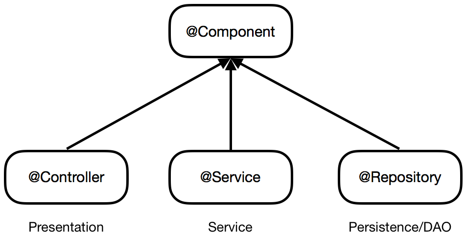
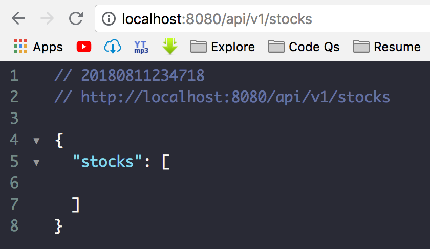
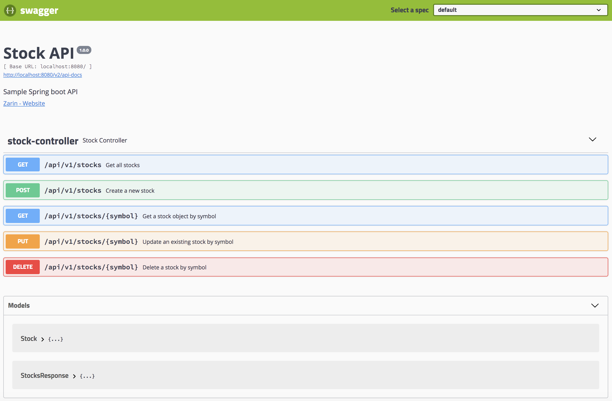

author: Zarin Lokhandwala
summary: How to Design a RESTful Spring Boot API
id: springboot-api
categories: spring-boot, springboot, restful-api, rest-api, api, mongodb, swagger, swagger-ui
environments: java
status: draft

# How to Design a RESTful Spring Boot API
<!-- ---------------------------------------------------------------------------------------------------------------- -->
## Overview
Duration: 15

### What you'll learn
- How to design an API using OpenAPI Spec (Swagger)
- How to develop a Spring boot API connected to MongoDB

### What you'll need
- Install [Git and Git Bash](https://git-scm.com/downloads)
- Install [Java 8](http://www.oracle.com/technetwork/java/javase/downloads/jdk8-downloads-2133151.html) or [Java 10](http://www.oracle.com/technetwork/java/javase/downloads/jdk10-downloads-4416644.html) JDK
- Install [Apache Maven](https://maven.apache.org/download.cgi)
- Install [MongoDB](https://www.mongodb.com/download-center#community)
- Install [IntelliJ](https://www.jetbrains.com/idea/) or any other IDE of your choice 

<!-- ---------------------------------------------------------------------------------------------------------------- -->
## Covering API Endpoints
Duration: 3

We will be creating 5 RESTful API endpoints. For this code lab we will be creating an API to retrieve stock information.
The API will contain the following resource methods:

- GET multiple stock objects 
- GET a stock object
- POST or create a new stock object 
- PUT or update an existing stock object 
- DELETE a stock object 

### Actual Endpoints

1. GET `/stocks`
2. GET `/stocks/{symbol}`
3. POST `/stocks/{symbol}`
4. PUT `/stocks/{symbol}`
5. DELETE `/stocks/{symbol}`

<!-- ---------------------------------------------------------------------------------------------------------------- -->
## Spec Driven Development
Duration: 2

Ideal software development occurs in two distinct phases:
1. The creation of a Spec
2. Development of code to match the Spec 

Spec Driven Development is the process of generating a concise spec that can be used to describe your application's interactions in a pragmatic way. In other words, the Spec is a blueprint for your application, detailing how the user interacts with it, rather than just expected behaviors/results. In order to be successful with Spec Driven Development, the Spec must be:
1. **Standardized**: Use of a standard Spec related to the type of application you are building 
2. **Consistent**: The Spec should remain consistent throughout in operations, utlizing consistent design patterns
3. **Tested**: Agile development of the Spec, incorporating repeated user feedback with long-term focus in mind 
4. **Concrete**: The creation of a complete, foundational Spec to be used for your application 
5. **Immutable**: Coding to the Spec without deviation 
6. **Persistent**: The Spec is not changed without strong reason and careful testing 

### Specs Available 

- [RAML](https://raml.org/)
- [API Blueprint](https://apiblueprint.org/)
- [Swagger](https://swagger.io/) (renamed to [OpenAPI Spec](https://github.com/OAI/OpenAPI-Specification))

We will be utilizing Swagger framework to design, produce, visualize, and consume our RESTful service. It provides a programming language-agnostic interface, which allowed both humans and computers to discover and understand the capabilities of a service without requiring access to source code. 

✅Move on to the next step to start building your API Spec!

<!-- ---------------------------------------------------------------------------------------------------------------- -->
## Creating the Spec (Pt I)
Duration: 15

Swagger spec can be written in either JSON or YAML. We will be using YAML for this code lab. 

You can use the online swagger editor: [editor.swagger.io](https://editor.swagger.io/)

For this code lab, we are going to create a simple Stocks API that will manage a database full of various stock objects. 

To start a Swagger YAML file, you need to add the `info` object at the start of the file/editor. 

~~~yaml
swagger: '2.0'
info:
  version: 1.0.0
  title: Stock API
  description: Spring boot API that maintains stocks in a MongoDB
  contact:
    name: Zarin
    url: 'https://github.com/zarinlo'
basePath: /api/v1
host: 'localhost:8080'
schemes:
  - https
  - http
consumes:
  - application/json
produces:
  - application/json
~~~

Let's understand the important properties of this Swagger spec so far: 
- `swagger`: The version of the Swagger spec you are using (i.e. 2.0)
- `info`: The info block contains important meta-details regarding your API 
- `version`: The version of the API being developed, which should follow [Semantic Versioning](https://semver.org). Semantic versioning consists of three digits, the first numnber indicating the **major** version of an application, the next number is known as **minor** which indicates any features that have been added, and the last number indicates the **patch** fix that has been applied. The **major** number is what is actually taken into consideration when determining the base path of an API. 
- `host`: The host name and port or the IP address of the F5 URL that is hosting/serving the API
- `basePath`: This is the base path that your API will be served on before the context path is supplied for the hosted application. The context path is essentially the resource name, so in this case since we will be implementing a stocks API, the context path will be set to `/stocks`. Therefore, the full path after the hostname/URL is `/api/v1/stocks`.
- `schemes`: A defined list of which protocols the API is using to transfer data between the client and server. Transferring text data is done via HTTP(S) where the 'S' stands for secured. 
- `consumes`: A list of [MIME](https://webplatform.github.io/docs/concepts/Internet_and_Web/mime_types/) types the [CRUD](https://en.wikipedia.org/wiki/Create,_read,_update_and_delete) operations can consume. MIME types enable browsers to recognize the file-type of a file, which has been sent via HTTP by a server. Think of this as the 'Accept' header on the client side being set to 'application/json'. 
- `produces`: A list of MIME types the operations can produce. Think of this as the 'Content-Type' header that is set on the client side, which lets the server know the format of the data being sent. 

Let's expand this YAML by adding our frist REST API definition. To implement the GET `/stocks` endpoint, we first need to define the object data type being requested and modified. 

~~~yaml
definitions:
  Stock:
    type: object
    required:
      - description
      - lastUpdated
      - name
      - price
      - symbol
    properties:
      description:
        type: string
      lastUpdated:
        type: string
      name:
        type: string
      price:
        type: integer
      symbol:
        type: string
~~~

In the code block above, we are defining the Stock object that has five required attributes. Under the `properties` tag we describe the **type** of each attribute being either a string or integer. You can elaborate on the types, just do a quick google search. 

Now take a step back. The most commonly used Content-Type porduced and consumed by modern APIs is JSON. The `/stocks` endpoint should therefore be returning an object as the response. In this case, an object of array of Stock objects. We should not be returning a top-level array (shown below). To return an object of an array of Stock objects, we need to define another object model as we did 'Stock'. 

Top-level array (bad practice):
~~~js
[
  {},
  {},
  {}
]
~~~
Object of array of objects (correct response model):
~~~js
{
  "stocks": [
    {},
    {},
    {}
  ]
}
~~~

Add the following to ensure that your `/stocks` endpoint returns an object of array of stock objects. Make sure you align the 'StocksResponse' block with the 'Stocks' block from above. YAML is sensitive to tabs, spaces, and everything in between. 

~~~yaml
  StocksResponse:
    type: object
    required:
      - stocks
    properties:
      stocks:
        type: array
        items:
          $ref: '#/definitions/Stock'
~~~

✅Move on to the next step to add the API operations.

<!-- ---------------------------------------------------------------------------------------------------------------- -->
## Creating the Spec (Pt II)
Duration: 15

Now we are ready to implement the GET `/stocks` method. We are going to continue our Spec above directly above the **definitions** section. This section is normally kept towards the bottom of the Spec. 

~~~yaml
tags:
  - name: stock
    description: Stock Controller
paths:
  /stocks:
    x-swagger-router-controller: stocks
    get:
      tags:
        - stock
      description: Get all stocks
      operationId: getStocks
      responses:
        '200':
          description: stocks found
          schema:
            $ref: '#/definitions/StocksResponse'
~~~

Once again, here's the breakdown of the tags:
- `tags`: Tags are used to group operations together for a specific reason 
- `paths`: This is where you specify the context path along with any path parameter required. The first path defined is the just the context path, `/stocks'. 
- `get`: The method being applied to a given path 
- `description`: A short description of what the method does 
- `operationId`: The actual name of the method/function in your source code 
- `responses`: A list of possible HTTP status codes returned by the server as a response to the client. Take a look at [HTTP status codes](https://httpstatuses.com/) to understand which HTTP numeric response is appropriate for a given method. 
- `schema`: Used to set the data-type of the content being returned by the method. A method will not always return content. For instance, DELETE, does not return any content back to the client since it has been removed, unless you save it as a temporary variable before deleting the item/object. Notice how the `$ref` tag points to the 'StocksResponse` definition under schema, this relates back to the premise of not returning a top-level array. 

Since we are already working on the `/stocks` endpoint, let's implement the POST method. Under the context path you can return objects as well as create them. 

~~~yaml
    post:
      tags:
        - stock
      description: Create a stock
      operationId: createStock
      parameters:
        - name: stock
          in: body
          description: New stock object
          required: true
          schema:
            $ref: '#/definitions/Stock'
      responses:
        '201':
          description: stock created
          schema:
            $ref: '#/definitions/Stock'
~~~

In order to create an object, the client is going to pass the server some data. The client can pass data as: 
- a query parameter
- an object sent via the body of a request
- a URL path parameter
- a cookie 
- a Header value 
- etc...

In this case, the POST request is done via the body. To learn more about parameter types, check out the [Describing Parameters](https://swagger.io/docs/specification/describing-parameters) page. Let's break down the above code snippet again:
- `parameters`: The parameters of an operation 
- `name`: A descriptive name for the data being requested 
- `in`: The location of the parameter (i.e. query, body, path, etc)

We have now completed the spec for the operations that can be performed under the `/stocks` endpoint. 

✅Move on to the next step to complete your API spec.

<!-- ---------------------------------------------------------------------------------------------------------------- -->
## Creating the Spec (Pt III)
Duration: 8

Let's implement other operations under the next path, which consists of the context path + parameter value: `/stocks/{symbol}`

~~~yaml
  '/stocks/{symbol}':
    x-swagger-router-controller: stocks
    get:
      tags:
        - stock
      description: Get a stock object by stock symbol
      operationId: getStockBySymbol
      parameters:
        - name: symbol
          in: path
          description: A stock symbol
          required: true
          type: string
      responses:
        '200':
          description: stock found
          schema:
            $ref: '#/definitions/Stock'
        '404':
          description: Not found
    put:
      tags:
        - stock
      description: Update an existing stock object by stock symbol
      operationId: updateStockBtSymbol
      parameters:
        - name: symbol
          in: path
          description: A stock symbol
          required: true
          type: string
        - name: updatedStock
          in: body
          description: Updated stock object
          required: true
          schema:
            $ref: '#/definitions/Stock'
      responses:
        '202':
          description: stock updated
          schema:
            $ref: '#/definitions/Stock'
        '404':
          description: Not found
    delete:
      tags:
        - stock
      description: Delete a stock object by stock symbol
      operationId: deleteStockBySymbol
      parameters:
        - name: symbol
          in: path
          description: A stock symbol
          required: true
          type: string
      responses:
        '204':
          description: stock deleted
        '404':
          description: Not found
~~~

Take a look at how the path is defined and notice that it's surrounded by quotes. In YAML, when you don't want special characters to be handled any other way besides a string, you use quotes to ensure that. 

Each of the operations above will require a path parameter denoted by the `in: path` key-value pair. The update operation (PUT), however, takes in both a path parameter and an object via the body. 

➡️ <a href="../elements/assets/springboot-api/swagger.yaml" style download>View Swagger in YAML</a>

➡️ <a href="../elements/assets/springboot-api/swagger.json" style download>View Swagger in JSON</a>

✅You've completed your first basic API spec! Now let's start by scaffolding (i.e. structuring) your Spring boot project. 

<!-- ---------------------------------------------------------------------------------------------------------------- -->
## Scaffold Your Spring API
Duration: 3

A tool that scaffolds your web project for you is a tool that helps you kickstart new projects, which presecribes best practices and folder structure to help you stay productive. We will use Spring Initialzr to scaffold your basic Spring boot API.

### Using Spring Initialzr

Spring Initialzr can be accessed via a web UI or through your IDE (i.e. IntelliJ/Eclipse). It generates a minimal project with the dependencies of your choice and enables you to start developing quickly. 

1. Navigate to the web UI Spring Initialzr: [https://start.spring.io](https://start.spring.io)
2. Fill in the following: Generate a **Maven Project** with **Java** and Spring Boot **2.0.3**
3. Fill in the artifact details: 
  a. Group = **sample**
  b. Artifact = **api**
4. In the Dependencies sections add: **Web**, **MongoDB**, and **Security**
5. Click **Generate Project** and a download should start for the project. 


<!-- ---------------------------------------------------------------------------------------------------------------- -->
## API Project Structure
Duration: 2

Before we begin constructing our API, let's setup the structure of the project correctly. Once you extract the initial zip file from the previous step, ensure you directory structure looks like the following: 

```bash
|api
|---|src
|---|---|main
|---|---|---|java
|---|---|---|---|sample
|---|---|---|---|---|api
|---|---|---|resources
|---|---|test
```

You should rename the initial **api** folder to something else, for instance, **sample-springboot-api**.

```bash
|sample-springboot-api
|---|src
|---|---|main
|---|---|---|java
|---|---|---|---|sample
|---|---|---|---|---|api
|---|---|---|resources
|---|---|test
```

Now, let's create the other directories that we will need going further. 

```bash
|sample-springboot-api
|---|src
|---|---|main
|---|---|---|java
|---|---|---|---|sample
|---|---|---|---|---|api
|---|---|---|---|---|---|config
|---|---|---|---|---|---|exceptions
|---|---|---|---|---|---|stock
|---|---|---|---|---|---|---|models
|---|---|---|---|---|---|---|repositories
|---|---|---|---|---|---|---|services
|---|---|---|resources
|---|---|test
```

Under the **api** folder you have a **stock** folder, which is where we are going to define the Stock controller, object classes and services. Under the **config** and **exceptions** folder, we will create shared classes that the entire project will use. 

<!-- ---------------------------------------------------------------------------------------------------------------- -->
## Configuring your Maven Settings
Duration: 5

Before we can import your API into any IDE (i.e. IntelliJ), we need to configure your maven settings. Once you have installed maven you also need to inlcude a `settings.xml` file directly under your **.m2** folder. Your **.m2** folder should be in your user home directory. Take a look at the maven install guide to ensure that your folder is in the correct place. 

The file will be used by maven to install the needed dependencies and it points to public repositories, which your local machine will reference when it's pulling down dependencies. If you are running into issues with downloading the dependencies, you may need to configure the **proxy** section. e

➡️ <a href="../elements/assets/springboot-api/settings.xml" style download>View settings.xml file</a>

You can find more information on a default `settings.xml` file here: [Apache Maven: settings.xml](https://github.com/apache/maven/blob/master/apache-maven/src/conf/settings.xml)

<!-- ---------------------------------------------------------------------------------------------------------------- -->
## Importing your API Project
Duration: 8

If you are using IntelliJ, import your project as a Maven project. You can run through the following to make sure your project has been imported and configured correctly. 

### Import Project
Import the project as a Maven project. Continue through the wizard and let all the dependencies load, which may take some time. 
- Reference: [Importing a Maven Project](https://www.jetbrains.com/help/idea/maven-support.html#maven_import_project_start)

<!--  -->

### Maven Build Repository
Under **Preferences** OR **File** --> **Settings**, go to **Build, Execution. Deployment** --> **Build Tools** --> **Maven**, and make sure the remote repository URLs are being pulled from your `settings.xml` file.
- Reference: [Maven. Repositories](https://www.jetbrains.com/help/idea/maven-repositories.html)


### Set Project SDK
Under **File** --> **Project Structure** --> **Project**, make sure that you set your project SDK to java1.8 or java1.10. 
- Reference: [Working with SDKs](https://www.jetbrains.com/help/idea/sdk.html)

### Setup Run Configurations
In order to run your project, go ahead and setup a **Spring Boot** run configuration. 
- Reference: [Creating and Editing Run/Debug Configurations](https://www.jetbrains.com/help/idea/creating-and-editing-run-debug-configurations.html)

### Reimport Project (if needed)
Once you have imported the project, there may be times where you need to reimport depenedencies incase you add/change/remove dependencies. Press `Ctrl`+`Shift`+`A` to find actions, and input "reimport", you will find the "Reimport All Maven Projects". On a Mac, use ⌘ + ⇧ + A instead.


### Synchronize Project (if needed)
To synchronize your project, right-click on the project folder and hit Synchronize. You can also do this from the maven projects tool window. 

- Reference: [Maven Projects Tool Window](https://www.jetbrains.com/help/idea/maven-projects-tool-window.html)

✅Continue on to the next step to start creating the Object model classes for a Stock as we defined in our API Spec. 

<!-- ---------------------------------------------------------------------------------------------------------------- -->
## Creating API Object Models
Duration: 8

Create a class called `Stock.java` under the **models** package (i.e. directory) with the following attributes:
- name
- description
- symbol
- price
- lastUpdated 

You will need to Generate getters and setters for this Object class so that you can access and modify the objects as needed. Under **Code** --> **Generate** select **Getter and Setter** and select all the attributes to generate them for. 

~~~java
import java.time.LocalDateTime;

public class Stock {
    String symbol;
    String name;
    String description;
    Double price;
    LocalDateTime lastUpdated;

    public String getSymbol() {
        return symbol;
    }

    public void setSymbol(String symbol) {
        this.symbol = symbol;
    }

    public String getName() {
        return name;
    }

    public void setName(String name) {
        this.name = name;
    }

    public String getDescription() {
        return description;
    }

    public void setDescription(String description) {
        this.description = description;
    }

    public Double getPrice() {
        return price;
    }

    public void setPrice(Double price) {
        this.price = price;
    }

    public LocalDateTime getLastUpdated() {
        return lastUpdated;
    }

    public void setLastUpdated(LocalDateTime lastUpdated) {
        this.lastUpdated = lastUpdated;
    }
}
~~~

Now according to our API spec, we do NOT want to return a top-level array for the GET `/stocks` endpoint. Create another class called `StocksResponse` with the following getter and setter as well as Constructor. 
- stocks

~~~java
import java.util.List;

public class StocksResponse {
    List<Stock> stocks;

    public StocksResponse(List<Stock> stocks) {
        this.stocks = stocks;
    }

    public List<Stock> getStocks() {
        return stocks;
    }

    public void setStocks(List<Stock> stocks) {
        this.stocks = stocks;
    }
}
~~~

✅Now let's design our first API endpoint! 

<!-- ---------------------------------------------------------------------------------------------------------------- -->
## Spring Annotations Overview
Duration: 5

Annotations in Java is a special form of metadata that can be embedded in Java source code. Users can use annotations to configure beans inside the java source file itself. 

Here is a simple overview of common Spring annotations:


- `@Component`: Generic stereotype for any Spring-managed component
- `@Repository`: The Persistence layer (Data Access Layer) of the application, which is used to get data from the database. All the database related operations are done by the repository.       
- `@Service`: Stereotype for service layer where all business logic is done, data related calculations and all. 
- `@Controller`: Stereotype for presentation layer (spring-mvc). This is where your request mapping from presentation page is done. The Presentation layer won't go to any other file, it goes directly to the `@Controller` class and checks for requested path under the `@RequestMapping` annotation, before a method is called.

<!-- ---------------------------------------------------------------------------------------------------------------- -->
## GET /stocks (Pt I)
Duration: 15

In Spring's approach to building RESTful web services, HTTP requests are handled by a controller. These components are easily identified by the `@RestController` annotation. 

Create a class called `StockController.java` under the **stock** package and annotate the class with `@RestController`. Add another annotation to the same class with `@RequestMapping("/api/v1")`. The request mapping creates a root API context of **/api/v1** and every endpoint created in the controller will begin with that context. This can also be a way to version your API. 

~~~java
import org.springframework.web.bind.annotation.*;

@RestController
@RequestMapping("/api/v1")
public class StockController {

}
~~~

Create a method called `getStocks` and annotate it with `@RequestMapping("/stocks)`. This creates a handler for GET requests at the URL path `/stocks`. This method should return an array Stock objects, which we will create in just a bit. You can also control the response format returned by the API. Set the `produces` parameter to `application/json`. 

~~~java
import org.springframework.web.bind.annotation.*;

@RestController
@RequestMapping("/api/v1")
public class StockController {

    @RequestMapping(value = "/stocks", method = RequestMethod.GET, produces = "application/json")
    public StocksResponse getStocks() {

    }
}
~~~

Include `@ApiOperation` to verbalize what the endpoint is used for and `@ResponseStatus` to set the status code for the HTTP response. The `@ApiOperation` annotation is used for our API spec, which will be displayed via Swagger UI. We will go over Swagger later in this lab, but for now, just understand that we will be using [SpringFox](http://springfox.github.io/springfox/) to setup swagger for our API. To set this up you will need to add the following two dependencies in your `pom.xml` file, which is found at the root of the project. The pom file contains all the dependencies that your project will need. 

~~~xml
<dependency>
    <groupId>io.springfox</groupId>
    <artifactId>springfox-swagger2</artifactId>
    <version>2.9.2</version>
</dependency>
<dependency>
    <groupId>io.springfox</groupId>
    <artifactId>springfox-swagger-ui</artifactId>
    <version>2.9.2</version>
</dependency>
~~~

~~~java
import io.swagger.annotations.ApiOperation;
import org.springframework.http.HttpStatus;
import org.springframework.web.bind.annotation.*;

@RestController
@RequestMapping("/api/v1")
public class StockController {

    @ApiOperation(value = "Get all stocks")
    @RequestMapping(value = "/stocks", method = RequestMethod.GET, produces = "application/json")
    @ResponseStatus(HttpStatus.OK)
    public StocksResponse getStocks() {

    }
}
~~~

✅You are now ready to move onto the next step.

<!-- ---------------------------------------------------------------------------------------------------------------- -->
## Setup Interface to MongoDB Repository 
Duration: 10

In order to interact with MongoDB, we will be using Spring's MongoDB data repository. Spring data repositories simplify the amount of code required to implement data access layers for various persistence stores. All that's required to get this working is to create an interface that extends the Spring MongoDB repository. So let's create a `StockRepository.java` interface that `extends` the `MongoRepository` under the **repositories** package. We want to annotate this persistence layer with `@Repository`, which again, is a stereotype annotation applied to data access layers that are used to get data from the database. 

Out-of-the-box, this interface comes with many operations, including standard CRUD (create-read-update-delete) operations. Spring has its' own [query builder mechanism](https://docs.spring.io/spring-data/jpa/docs/current/reference/html/#repositories.query-methods.query-creation) and the `findAll` method is already provided by default, so for now, we will leave this interface empty of additional queries. 

When you extend the interface, the `<Stock, String>` implies that the MongoDB will contain Stock objects and stored as strings. 

~~~java
import org.springframework.data.mongodb.repository.MongoRepository;
import org.springframework.stereotype.Repository;

@Repository
public interface StockRepository extends MongoRepository<Stock, String> {

}
~~~

Let's take a step back and go back to the `Stock` object model class. We want to annotate our **symbol** property with `@Id`. This tells MongoDB that we want to use the **symbol** as the unique identifier for our stock objects.  

~~~java
import org.springframework.data.annotation.Id;
import java.time.LocalDateTime;

public class Stock {
    @Id
    String symbol;
    String name;
    String description;
    Double price;
    LocalDateTime lastUpdated;
    ...
}
~~~

<!-- ---------------------------------------------------------------------------------------------------------------- -->
## GET /stocks (Pt II)
Duration: 10

Now we will `@Autowire` the `StockRepository` in our `StockController`. Autowiring in Spring enables you to inject the object dependency implicitly. It internally uses setter or constructor injection. Then we will use the predefined method, `findAll()`, to retrieve all the stock objects from MongoDB. The `All` is a reserved keyword that refers to all objects of the managed entity class, i.e. the Stock class. 

~~~java
import io.swagger.annotations.ApiOperation;
import org.springframework.beans.factory.annotation.Autowired;
import org.springframework.http.HttpStatus;
import org.springframework.web.bind.annotation.*;

@RestController
@RequestMapping("/api/v1")
public class StockController {

    @Autowired
    private StockRepository stockRepository;

    @ApiOperation(value = "Get all stocks")
    @RequestMapping(value = "/stocks", method = RequestMethod.GET, produces = "application/json")
    @ResponseStatus(HttpStatus.OK)
    public StocksResponse getStocks() {
        return new StocksResponse(stockRepository.findAll());
    }
}
~~~

At this point, you can startup the API locally by running `./mvnw spring-boot:run` on a MacOS or `mvnw.cmd spring-boot:run` on a Windows. By default, the API will be running on [http://localhost:8080/api/v1/stocks](http://localhost:8080/api/v1/stocks). Open a browser and try the GET request just by hitting that endpoint. You should see an empty stock array object as the response. 



<!-- ---------------------------------------------------------------------------------------------------------------- -->
## Define Application Properties
Duration: 15

Spring allows you to configure/enable/disable various application properties rather easily via its `application.properties` file. You can set custom configurations as well. This file is found under the **src/main/resources** folder. 

Spring also allows you to handle properties per environment (i.e. dev, qa, prod). This is taken care of in the naming convention of the file. In order to select which file / profile to use at runtime, you can do so in multiple ways as well. 

### Properties per Environment

In order to keep the environment properties organized, we will create the following files under `src/main/resources`. Notice the naming convention we use in the files. 
- `application.properties`
- `application-local.properties`
- `application-dev.properties`
- `application-qa.properties`
- `application-prod.properties`

We have successfully created four files. The local properties file will be used for `local` testing, `dev` will be used for the development servers, `qa` for Quality Assurance, and `prod` for the production environment. The default `application.properties` file will be include what is common amongst all the environments. Now there is a hierarchy for the ways that these files are sourced at runtime. Let's say you want to use the `local` properties file for the time being, Spring will initilize everything in that `local` file first, then it will initialize everything in the default `application.properties` file. However, for any property that has been declared in both the local file as well as prod file, Spring will use the values for the property declared in the `local` file vs the prod file, since that was the environment set by the user as the runtime environment. 

### Setting Runtime Environment 

Now there are multiple ways to set the runtime environment or in other words, the Active Profile. This goes back to configuring your [run/debug configurations](https://www.jetbrains.com/help/idea/creating-and-editing-run-debug-configurations.html). If you look closely, there is an option to set your **Active Profile**, and in that section, you can type in `local` or `dev`, etc. For the purposes of this tutorial, let's set the profile to `local`. 

Another way to initialize the profile on startup, would be to simply add a property in the `application.properties` at the top, which is the following:

```java
spring.profiles.active=local
```

Normally, I would not recommend declaring the runtime environment in this manner becuase you will have to update that property in a file that you version. You rather set this in your run/debug configurations instead. However, to understand more about how Spring profiles work, reference this: [Spring Boot features - Profiles](https://docs.spring.io/spring-boot/docs/current/reference/html/boot-features-profiles.html)
 
### Setting up Mongo Properties

In order to set the name of the mongo database, add the following properties in the `application-local.properties` folder. As you can see we will use Camel Case to name the mongo database. For db naming restrictions, reference: [Restrictions on DB Names](https://docs.mongodb.com/manual/reference/limits/#restrictions-on-db-names)

~~~java
spring.data.mongodb.database=sampleSpringApi
spring.data.mongodb.host=localhost
spring.data.mongodb.port=27017
~~~

The complete list of all predefined Spring application properties can be found here: [Common Application Properties](https://docs.spring.io/spring-boot/docs/current/reference/html/common-application-properties.html)

<!-- ---------------------------------------------------------------------------------------------------------------- -->
## GET /stocks (Pt III)
Duration: 1

Now take a step back and annotate the `Stock` class with `@Document` to name the collection inside the Mongo database that will store the stock objects. 

~~~java
import org.springframework.data.annotation.Id;
import org.springframework.data.mongodb.core.mapping.Document;

import java.time.LocalDateTime;

@Document(collection = "stocks")
public class Stock {
    @Id
    String symbol;
    String name;
    String description;
    Double price;
    LocalDateTime lastUpdated;
    ...
}
~~~

✅Let's generate some sample data to work with!

<!-- ---------------------------------------------------------------------------------------------------------------- -->
## Populate the MongoDB
Duration: 10

In order to have some sample data to test with, let's create a simple service to help populate our MongoDB. Before we create the service class, add this dependency to your pom file. 

~~~xml
<dependency>
    <groupId>com.mashape.unirest</groupId>
    <artifactId>unirest-java</artifactId>
    <version>1.4.9</version>
</dependency>
~~~

Now create a `StockUpdateService.java` class under the **services** package to help populate the mongo database with some sample stock data and annotate the class with `@Service`. 

~~~java
import com.mashape.unirest.http.HttpResponse;
import com.mashape.unirest.http.JsonNode;
import com.mashape.unirest.http.Unirest;
import com.mashape.unirest.http.exceptions.UnirestException;
import org.apache.http.client.HttpClient;
import org.apache.http.client.config.CookieSpecs;
import org.apache.http.client.config.RequestConfig;
import org.apache.http.impl.client.HttpClients;
import org.json.JSONObject;
import org.slf4j.Logger;
import org.slf4j.LoggerFactory;
import org.springframework.beans.factory.annotation.Autowired;
import org.springframework.scheduling.annotation.Scheduled;
import org.springframework.stereotype.Service;

import java.time.LocalDateTime;
import java.util.Iterator;

@Service
public class StockUpdateService {

    private static final Logger LOGGER = LoggerFactory.getLogger(StockUpdateService.class);

    @Autowired
    private StockRepository stockRepository;

    private static String API_URL = "https://api.iextrading.com/1.0/stock/market/batch";

    StockUpdateService() {
        HttpClient httpClient = HttpClients.custom()
                .setDefaultRequestConfig(RequestConfig.custom()
                        .setCookieSpec(CookieSpecs.STANDARD).build())
                .build();
        Unirest.setHttpClient(httpClient);
    }

    @Scheduled(fixedRate = 60000)
    public void updateStockQuotes() {
        LOGGER.info("Updating Stock Quotes");
        try {
            HttpResponse<JsonNode> stocksResponse = Unirest.get(API_URL)
                    .queryString("symbols", "AAPL, FB, BK, GOOGL, AMZN, SNAP, MSFT, IBM, MS")
                    .queryString("types", "quote")
                    .asJson();
            LOGGER.debug(stocksResponse.getBody().toString());
            JSONObject stocks = stocksResponse.getBody().getObject();
            Iterator keys = stocks.keys();
            while (keys.hasNext()) {
                String key = keys.next().toString();
                JSONObject stock = stocks.getJSONObject(key).getJSONObject("quote");
                saveToDatabase(stock);
            }
        } catch (UnirestException e) {
            e.printStackTrace();
        }
        LOGGER.info("Finished Updating Stock Quotes");
    }

    private void saveToDatabase(JSONObject stock) {
        Stock stockDTO = new Stock();
        stockDTO.setLastUpdated(LocalDateTime.now());
        stockDTO.setName(stock.getString("companyName"));
        stockDTO.setSymbol(stock.getString("symbol"));
        stockDTO.setPrice(stock.getDouble("latestPrice"));
        stockDTO.setDescription(stock.getString("primaryExchange"));
        LOGGER.info(String.format("Updating %s", stockDTO.getSymbol()));
        stockRepository.save(stockDTO);
    }
}
~~~

Take a look at the `updateStockQuotes` method and notice the `@Scheduled` annotation. The method will be called at a fixed rate, i.e. every 60000 milliseconds. To enable this, you must annotate the main `ApiApplication` class that is located under the **api** folder, with `@EnableScheduling`. 

~~~java
import org.springframework.boot.SpringApplication;
import org.springframework.boot.autoconfigure.SpringBootApplication;
import org.springframework.scheduling.annotation.EnableScheduling;

@EnableScheduling
@SpringBootApplication
public class ApiApplication {

	public static void main(String[] args) {
		SpringApplication.run(ApiApplication.class, args);
	}
}
~~~

✅You are now ready to design the next endpoint!

<!-- ---------------------------------------------------------------------------------------------------------------- -->
## GET /stocks/{symbol}
Duration: 5

To retrieve a stock by its' symbol, we add another method in our `StockRepository` utilizing Spring's query creation. 

~~~java
import org.springframework.data.mongodb.repository.MongoRepository;
import org.springframework.stereotype.Repository;
import sample.api.stock.models.Stock;

@Repository
public interface StockRepository extends MongoRepository<Stock, String> {

    Stock findBySymbol(String symbol);
}
~~~

Now all we need to do is add another `@RequestMapping` endpoint in our `StocksController`. According to our API Spec, in order to get a stock by symbol, we need to pass the symbol as a path variable. We represent this by using the `@PathVariable` annotation in our function. Furthermore, to ensure that a path variable is provided, use the `@ApiParam` annotation and set the **value** and **required** parameters.

Positive
: Before inserting the stock object into the database, we will upper-case the symbol. So when you search for symbols in the database, search for the upper-case version of the symbol. 

~~~java
import io.swagger.annotations.ApiOperation;
import io.swagger.annotations.ApiParam;
import org.springframework.beans.factory.annotation.Autowired;
import org.springframework.http.HttpStatus;
import org.springframework.web.bind.annotation.*;

@RestController
@RequestMapping("/api/v1")
public class StockController {

    @Autowired
    private StockRepository stockRepository;

    @ApiOperation(value = "Get all stocks")
    @RequestMapping(value = "/stocks", method = RequestMethod.GET, produces = "application/json")
    @ResponseStatus(HttpStatus.OK)
    public StocksResponse getStocks() {
        return new StocksResponse(stockRepository.findAll());
    }

    //---------------------------------------------------------------------------------------------------------------

    @ApiOperation(value = "Get a stock object by symbol")
    @RequestMapping(value = "/stocks/{symbol}", method = RequestMethod.GET, produces = "application/json")
    @ResponseStatus(HttpStatus.OK)
    public Stock getStockBySymbol(
            @ApiParam(value = "A stock symbol", required = true)
            @PathVariable String symbol) {
        Stock stockObj = stockRepository.findBySymbol(symbol.toUpperCase());
        return stockRepository.findBySymbol(symbol.toUpperCase());
    }
}
~~~

✅That was easy. Let's move on to the next step.

<!-- ---------------------------------------------------------------------------------------------------------------- -->
## POST /stocks
Duration: 5

This method is also fairly simple. Add another `@RequestMapping` to create a stock at the `/stocks` endpoint in our controller. Since this is a create method, we need to specify a body parameter in the function defintiion. This is represented by the `@RequestBody` annotation. 

The `StockRepository` has a predefined method called `save()` just like it has the `findAll()` method. This automatically saves the new stock entity and returns the object that was stored into the database, which is also what we want to return to the client. Further, don't forget to upper-case the symbol.

~~~java
import io.swagger.annotations.ApiOperation;
import io.swagger.annotations.ApiParam;
import org.springframework.beans.factory.annotation.Autowired;
import org.springframework.http.HttpStatus;
import org.springframework.web.bind.annotation.*;

@RestController
@RequestMapping("/api/v1")
public class StockController {

    @Autowired
    private StockRepository stockRepository;

    @ApiOperation(value = "Get all stocks")
    @RequestMapping(value = "/stocks", method = RequestMethod.GET, produces = "application/json")
    @ResponseStatus(HttpStatus.OK)
    public StocksResponse getStocks() {
        return new StocksResponse(stockRepository.findAll());
    }

    //---------------------------------------------------------------------------------------------------------------

    @ApiOperation(value = "Get a stock object by symbol")
    @RequestMapping(value = "/stocks/{symbol}", method = RequestMethod.GET, produces = "application/json")
    @ResponseStatus(HttpStatus.OK)
    public Stock getStockBySymbol(
            @ApiParam(value = "A stock symbol", required = true)
            @PathVariable String symbol) {
        Stock stockObj = stockRepository.findBySymbol(symbol.toUpperCase());
        return stockRepository.findBySymbol(symbol.toUpperCase());
    }

    //---------------------------------------------------------------------------------------------------------------

    @ApiOperation(value = "Create a new stock")
    @RequestMapping(value = "/stocks", method = RequestMethod.POST, produces = "application/json")
    @ResponseStatus(HttpStatus.CREATED)
    public Stock createStock(
            @ApiParam(value = "New stock object", required = true)
            @RequestBody Stock newStock) {
        newStock.setSymbol(newStock.getSymbol().toUpperCase());
        return stockRepository.save(newStock);
    }
}
~~~

✅Try out the next step!

<!-- ---------------------------------------------------------------------------------------------------------------- -->
## PUT /stocks/{symbol}
Duration: 10

For the `/stocks/{symbol}` endpoint, we will be utilizing the `@PathVariable` as well as the `@RequestBody` annotation. 

There is no predefined update method, however the `save()` method will be able to update an object by ID if the object already exists in the database. So the first thing we do is find the stock object by the symbol. Second, we update that stock object with the properties from the request body. Lastly, we save the updated stock object back to the database. 

~~~java
import io.swagger.annotations.ApiOperation;
import io.swagger.annotations.ApiParam;
import org.springframework.beans.factory.annotation.Autowired;
import org.springframework.http.HttpStatus;
import org.springframework.web.bind.annotation.*;

@RestController
@RequestMapping("/api/v1")
public class StockController {

    @Autowired
    private StockRepository stockRepository;

    @ApiOperation(value = "Get all stocks")
    @RequestMapping(value = "/stocks", method = RequestMethod.GET, produces = "application/json")
    @ResponseStatus(HttpStatus.OK)
    public StocksResponse getStocks() {
        return new StocksResponse(stockRepository.findAll());
    }

    //---------------------------------------------------------------------------------------------------------------

    @ApiOperation(value = "Get a stock object by symbol")
    @RequestMapping(value = "/stocks/{symbol}", method = RequestMethod.GET, produces = "application/json")
    @ResponseStatus(HttpStatus.OK)
    public Stock getStockBySymbol(
            @ApiParam(value = "A stock symbol", required = true)
            @PathVariable String symbol) {
        Stock stockObj = stockRepository.findBySymbol(symbol.toUpperCase());
        return stockRepository.findBySymbol(symbol.toUpperCase());
    }

    //---------------------------------------------------------------------------------------------------------------

    @ApiOperation(value = "Create a new stock")
    @RequestMapping(value = "/stocks", method = RequestMethod.POST, produces = "application/json")
    @ResponseStatus(HttpStatus.CREATED)
    public Stock createStock(
            @ApiParam(value = "New stock object", required = true)
            @RequestBody Stock newStock) {
        newStock.setSymbol(newStock.getSymbol().toUpperCase());
        return stockRepository.save(newStock);
    }

    //---------------------------------------------------------------------------------------------------------------

    @ApiOperation(value = "Update an existing stock by symbol")
    @RequestMapping(value = "/stocks/{symbol}", method = RequestMethod.PUT, produces = "application/json")
    @ResponseStatus(HttpStatus.ACCEPTED)
    public Stock updateStockBySymbol(
            @ApiParam(value = "A stock symbol", required = true)
            @PathVariable String symbol,
            @ApiParam(value = "Updated stock object", required = true)
            @RequestBody Stock updatedStock) {
        Stock foundStock = stockRepository.findBySymbol(symbol.toUpperCase());
        foundStock.setName(updatedStock.getName());
        foundStock.setDescription(updatedStock.getDescription());
        foundStock.setPrice(updatedStock.getPrice());
        foundStock.setLastUpdated(updatedStock.getLastUpdated());
        return stockRepository.save(foundStock);
    }
}
~~~

The above implementation works, but what happens when the user passes in a symbol that does not exist? If a stock object is not found, then the `foundStock` variable will be null and a NullPointerException will be thrown. To handle this, we need to check if the stock object exists or doesn't. If it was found, then perform the updates, otherwise, throw a not found exception. 

Spring's default exception handler will catch the exception and create a response message based on the exception details. So let's create a class called `StockNotFoundException` that extends a `RuntimeException` under the **exceptions** package. We will then annotate the entire class with `@ResponseStatus(HttpStatus.NOT_FOUND)`. THis will tell Spring to set the response code to `404` in the response. Now we can use this exception if the stock was not found. 

~~~java
import org.springframework.http.HttpStatus;
import org.springframework.web.bind.annotation.ResponseStatus;

@ResponseStatus(HttpStatus.NOT_FOUND)
public class StockNotFoundException extends RuntimeException {

    public StockNotFoundException(String message) {
        super(message);
    }
}
~~~

Below is the updated version of the `updateStockBySymbol()` method. We can apply the same logic to the `getStockBySymbol()` method as well. 

~~~java
import io.swagger.annotations.ApiOperation;
import io.swagger.annotations.ApiParam;
import org.springframework.beans.factory.annotation.Autowired;
import org.springframework.http.HttpStatus;
import org.springframework.web.bind.annotation.*;

@RestController
@RequestMapping("/api/v1")
public class StockController {

    @Autowired
    private StockRepository stockRepository;

    @ApiOperation(value = "Get all stocks")
    @RequestMapping(value = "/stocks", method = RequestMethod.GET, produces = "application/json")
    @ResponseStatus(HttpStatus.OK)
    public StocksResponse getStocks() {
        return new StocksResponse(stockRepository.findAll());
    }

    //---------------------------------------------------------------------------------------------------------------

    @ApiOperation(value = "Get a stock object by symbol")
    @RequestMapping(value = "/stocks/{symbol}", method = RequestMethod.GET, produces = "application/json")
    @ResponseStatus(HttpStatus.OK)
    public Stock getStockBySymbol(
            @ApiParam(value = "A stock symbol", required = true)
            @PathVariable String symbol) {
        Stock stockObj = stockRepository.findBySymbol(symbol.toUpperCase());
        if (stockObj != null) {
            return stockRepository.findBySymbol(symbol.toUpperCase());
        } else {
            throw new StockNotFoundException(String.format("The Stock with Symbol: %s, was not found in the database", symbol.toUpperCase()));
        }
    }

    //---------------------------------------------------------------------------------------------------------------

    @ApiOperation(value = "Create a new stock")
    @RequestMapping(value = "/stocks", method = RequestMethod.POST, produces = "application/json")
    @ResponseStatus(HttpStatus.CREATED)
    public Stock createStock(
            @ApiParam(value = "New stock object", required = true)
            @RequestBody Stock newStock) {
        newStock.setSymbol(newStock.getSymbol().toUpperCase());
        return stockRepository.save(newStock);
    }

    //---------------------------------------------------------------------------------------------------------------

    @ApiOperation(value = "Update an existing stock by symbol")
    @RequestMapping(value = "/stocks/{symbol}", method = RequestMethod.PUT, produces = "application/json")
    @ResponseStatus(HttpStatus.ACCEPTED)
    public Stock updateStockBySymbol(
            @ApiParam(value = "A stock symbol", required = true)
            @PathVariable String symbol,
            @ApiParam(value = "Updated stock object", required = true)
            @RequestBody Stock updatedStock) {
        Stock foundStock = stockRepository.findBySymbol(symbol.toUpperCase());
        if (foundStock != null) {
            foundStock.setName(updatedStock.getName());
            foundStock.setDescription(updatedStock.getDescription());
            foundStock.setPrice(updatedStock.getPrice());
            foundStock.setLastUpdated(updatedStock.getLastUpdated());
            return stockRepository.save(foundStock);
        } else {
            throw new StockNotFoundException(String.format("The Stock with Symbol: %s, was not found in the database", symbol.toUpperCase()));
        }
    }
}
~~~

✅Move onto the final endpoint!

<!-- ---------------------------------------------------------------------------------------------------------------- -->
## DELETE /stocks/{symbol}
Duration: 5

In order to delete a stock object by its' symbol, we need to first create another method in our `StockRepository` interface. Add a `deleteDistinctBySymbol` method and take note of the word **distinct**. This is another keyword that is defined in the Spring query builder. 

~~~java
import org.springframework.data.mongodb.repository.MongoRepository;
import org.springframework.stereotype.Repository;
import sample.api.stock.models.Stock;

@Repository
public interface StockRepository extends MongoRepository<Stock, String> {

    Stock findBySymbol(String symbol);
    void deleteDistinctBySymbol(String symbol);
}
~~~

Now in our controller, add a `@RequestMapping` to delete at the `/stocks/{symbol}` endpoint and pass in a `@PathVariable` (i.e. the stock symbol). Delete methods generally return a response code of `204`, i.e. No Content and no response message. To represent this, annotate the method in the controller with `@ResponseStatus(HttpStatus.NO_CONTENT)`. 

~~~java
import io.swagger.annotations.ApiOperation;
import io.swagger.annotations.ApiParam;
import org.springframework.beans.factory.annotation.Autowired;
import org.springframework.http.HttpStatus;
import org.springframework.web.bind.annotation.*;

@RestController
@RequestMapping("/api/v1")
public class StockController {

    @Autowired
    private StockRepository stockRepository;

    @ApiOperation(value = "Get all stocks")
    @RequestMapping(value = "/stocks", method = RequestMethod.GET, produces = "application/json")
    @ResponseStatus(HttpStatus.OK)
    public StocksResponse getStocks() {
        return new StocksResponse(stockRepository.findAll());
    }

    //---------------------------------------------------------------------------------------------------------------

    @ApiOperation(value = "Get a stock object by symbol")
    @RequestMapping(value = "/stocks/{symbol}", method = RequestMethod.GET, produces = "application/json")
    @ResponseStatus(HttpStatus.OK)
    public Stock getStockBySymbol(
            @ApiParam(value = "A stock symbol", required = true)
            @PathVariable String symbol) {
        Stock stockObj = stockRepository.findBySymbol(symbol.toUpperCase());
        if (stockObj != null) {
            return stockRepository.findBySymbol(symbol.toUpperCase());
        } else {
            throw new StockNotFoundException(String.format("The Stock with Symbol: %s, was not found in the database", symbol.toUpperCase()));
        }
    }

    //---------------------------------------------------------------------------------------------------------------

    @ApiOperation(value = "Create a new stock")
    @RequestMapping(value = "/stocks", method = RequestMethod.POST, produces = "application/json")
    @ResponseStatus(HttpStatus.CREATED)
    public Stock createStock(
            @ApiParam(value = "New stock object", required = true)
            @RequestBody Stock newStock) {
        newStock.setSymbol(newStock.getSymbol().toUpperCase());
        return stockRepository.save(newStock);
    }

    //---------------------------------------------------------------------------------------------------------------

    @ApiOperation(value = "Update an existing stock by symbol")
    @RequestMapping(value = "/stocks/{symbol}", method = RequestMethod.PUT, produces = "application/json")
    @ResponseStatus(HttpStatus.ACCEPTED)
    public Stock updateStockBySymbol(
            @ApiParam(value = "A stock symbol", required = true)
            @PathVariable String symbol,
            @ApiParam(value = "Updated stock object", required = true)
            @RequestBody Stock updatedStock) {
        Stock foundStock = stockRepository.findBySymbol(symbol.toUpperCase());
        if (foundStock != null) {
            foundStock.setName(updatedStock.getName());
            foundStock.setDescription(updatedStock.getDescription());
            foundStock.setPrice(updatedStock.getPrice());
            foundStock.setLastUpdated(updatedStock.getLastUpdated());
            return stockRepository.save(foundStock);
        } else {
            throw new StockNotFoundException(String.format("The Stock with Symbol: %s, was not found in the database", symbol.toUpperCase()));
        }
    }

    //---------------------------------------------------------------------------------------------------------------

    @ApiOperation(value = "Delete a stock by symbol")
    @RequestMapping(value = "/stocks/{symbol}", method = RequestMethod.DELETE, produces = "application/json")
    @ResponseStatus(HttpStatus.NO_CONTENT)
    public void deleteStockBySymbol(
            @ApiParam(value = "A stock symbol", required = true)
            @PathVariable String symbol) {
        stockRepository.deleteDistinctBySymbol(symbol.toUpperCase());
    }
}
~~~

✅Let's add the user interface for Swagger now that all of our endpoints are complete!

<!-- ---------------------------------------------------------------------------------------------------------------- -->
## Add Swagger UI
Duration: 8

Since we already setup the dependencies needed for Swagger UI, now all we have to do is add the Swagger Configuration class. 

Let's start by creating a class called `SwaggerConfig.java` under the **config** pacakge. Since this class is used to configure swagger add `@EnableSwagger2` and annotate the class with `@Configuration`. The version of the API is set to `1.0.0`, which, again, is following the rules of Semantic Versioning. You can read more about the springfox configurable properties on their website: [SpringFox Documentation](https://springfox.github.io/springfox/docs/current/)

~~~java
import org.springframework.context.annotation.Bean;
import org.springframework.context.annotation.Configuration;
import org.springframework.http.ResponseEntity;
import org.springframework.web.bind.annotation.RestController;
import springfox.documentation.builders.ApiInfoBuilder;
import springfox.documentation.builders.PathSelectors;
import springfox.documentation.builders.RequestHandlerSelectors;
import springfox.documentation.service.ApiInfo;
import springfox.documentation.service.Contact;
import springfox.documentation.spi.DocumentationType;
import springfox.documentation.spring.web.plugins.Docket;
import springfox.documentation.swagger2.annotations.EnableSwagger2;

@Configuration
@EnableSwagger2
public class SwaggerConfig {

    @Bean
    public Docket documentation() {
        return new Docket(DocumentationType.SWAGGER_2)
                .select()
                .apis(RequestHandlerSelectors.withClassAnnotation(RestController.class))
                .paths(PathSelectors.any())
                .build()
                .pathMapping("/")
                .genericModelSubstitutes(ResponseEntity.class)
                .useDefaultResponseMessages(false)
                .apiInfo(metadata());
    }

    private ApiInfo metadata() {
        return new ApiInfoBuilder()
                .title("Stock API")
                .description("Sample Spring boot API")
                .version("1.0.0")
                .contact(new Contact("Zarin", "https://github.com/zarinlo", ""))
                .build();
    }
}
~~~

✅Move onto adding the next configuration. 

<!-- ---------------------------------------------------------------------------------------------------------------- -->
## Configure CORS
Duration: 10

Cross-origin resource sharing, also known as CORS, is a mechanism that allows restricted resources (e.g. fonts, images) on a web page to be requested from another domain outside the domain from which the first resource was served. A web page may freely embed cross-origin images, stylesheets, scripts, iFrames, and videos. 

CORS defines a way in which a browser and server can interact to determine whether or not it is safe to allow the cross-origin request. 

To enable this, create a `CorsConfig.java` class under the **config** package. You can reference the [Web Application Security](https://docs.spring.io/spring-security/site/docs/current/reference/html/cors.html) section for further details. 

~~~java
import org.springframework.context.annotation.Bean;
import org.springframework.context.annotation.Configuration;
import org.springframework.security.config.annotation.web.builders.HttpSecurity;
import org.springframework.security.config.annotation.web.configuration.EnableWebSecurity;
import org.springframework.security.config.annotation.web.configuration.WebSecurityConfigurerAdapter;
import org.springframework.web.cors.CorsConfiguration;
import org.springframework.web.cors.CorsConfigurationSource;
import org.springframework.web.cors.UrlBasedCorsConfigurationSource;

import java.util.Arrays;

@Configuration
@EnableWebSecurity
public class CorsConfig extends WebSecurityConfigurerAdapter {

    @Override
    protected void configure(HttpSecurity http) throws Exception {
        http.cors();
    }

    @Bean
    CorsConfigurationSource corsConfigurationSource() {
        CorsConfiguration configuration = new CorsConfiguration();
        configuration.setAllowedOrigins(Arrays.asList("*"));
        configuration.setAllowCredentials(true);
        configuration.setAllowedHeaders(Arrays.asList("Access-Control-Allow-Headers","Access-Control-Allow-Origin","Access-Control-Request-Method", "Access-Control-Request-Headers","Origin","Cache-Control", "Content-Type", "Authorization"));
        configuration.setAllowedMethods(Arrays.asList("DELETE", "GET", "POST", "PATCH", "PUT"));
        UrlBasedCorsConfigurationSource source = new UrlBasedCorsConfigurationSource();
        source.registerCorsConfiguration("/**", configuration);
        return source;
    }
}
~~~

✅Finalize your application properties.

<!-- ---------------------------------------------------------------------------------------------------------------- -->
## Spring Properties and Actuators
Duration: 5

We covered how to add Spring properties to the `application-local.properties`, so now we'll go over different [Spring actuators](https://docs.spring.io/spring-boot/docs/current/reference/html/production-ready-endpoints.html) that you can add to the `application.properties` file. Notice that we are not adding these actuators to the `local` properties file, because we want to enable certain features for the entire application.

Actuator endpoints let you monitor and interact with your application. Spring boot includes a number of built-in endpoints and lets you add your own as well. 

To enable spring actuator support, include the following in your `pom.xml` file. 

~~~xml
<dependency>
    <groupId>org.springframework.boot</groupId>
    <artifactId>spring-boot-starter-actuator</artifactId>
</dependency>
~~~

### Actuator Endpoints

Let's add a couple of endpoints to the `application.properties` file to demonstrate the use of actuators. By default, actuators can be discovered via the `/actuator` endpoint. If you want to override this so that you can access the endpoints via the root path, `\`, we will include the first line as shown. You can add multiple web endpoints, just check the spring actuator documentation linked. 

~~~java
management.endpoints.web.base-path=/
management.endpoints.web.exposure.include=health, metrics, httptrace, mappings
~~~

### Application Properties 

The `LocalDateTime` property in the Swagger UI will show up as an object instead of an ISO8601 string. In order to fix this, we have to add the following [Jackson ObjectMapper](https://docs.spring.io/spring-boot/docs/current/reference/html/howto-spring-mvc.html#howto-customize-the-jackson-objectmapper) environment property. Keep in mind, you will add this to your `application.properties` file vs your `application-local.properties` file because we want this to be enabled for every environment, and not just specifically for your local testing. 

~~~java
spring.jackson.serialization.write-dates-as-timestamps=false
~~~

✅Next, add in your final build steps. 

<!-- ---------------------------------------------------------------------------------------------------------------- -->
## Finalize Build Configurations
Duration: 5

In your `pom.xml` file we need to add the **repackage** goal for the **spring-boot-maven-plugin**. This will package the jar to be an executable so that we can run it as a standalone process. Lastly, add in the **maven-compiler-plugin** so that we can set the source compiler and target for our application. You can set the compiler and target in your IDE as well, but this is another way to do just that. 

Positive
: If you are using Java 1.8, change the 1.10 to 1.8.

~~~xml
<build>
    <plugins>
        <plugin>
            <groupId>org.springframework.boot</groupId>
            <artifactId>spring-boot-maven-plugin</artifactId>
            <version>2.0.3.RELEASE</version>
            <executions>
                <execution>
                    <goals>
                        <goal>repackage</goal>
                    </goals>
                </execution>
            </executions>
        </plugin>
        <plugin>
            <groupId>org.apache.maven.plugins</groupId>
            <artifactId>maven-compiler-plugin</artifactId>
            <configuration>
                <source>1.10</source>
                <target>1.10</target>
            </configuration>
        </plugin>
    </plugins>
</build>
~~~

Fill in the `properties` tag if it was not set already by Spring Initialzr.

~~~xml
<properties>
    <project.build.sourceEncoding>UTF-8</project.build.sourceEncoding>
    <project.reporting.outputEncoding>UTF-8</project.reporting.outputEncoding>
    <java.version>1.10</java.version>
</properties>
~~~

✅Thats it! You are now ready to run your API locally! 

<!-- ---------------------------------------------------------------------------------------------------------------- -->
## Run API Locally
Duration: 3

Run the following commands in your root directory.

### MacOS Users
~~~sh
./mvnw clean install 
./mvnw spring-boot:run
~~~

### Windows Users
~~~sh
mvnw.cmd clean install 
mvnw.cmd spring-boot:run
~~~

Navigate to [http://localhost:8080/swagger-ui.html](http://localhost:8080/swagger-ui.html). You should see the Swagger UI. From here, you can expand each endpoint and test out all of your API operations with the "Try it out" button. 



SpringFox auto-generates Swagger in JSON format, which can be found at [http://localhost:8080/v2/api-docs](http://localhost:8080/v2/api-docs). The **v2** stands for the version of Swagger, not the version of the API. You can see the stock data stored in mongo at [http://localhost:8080/api/v1/stocks](http://localhost:8080/api/v1/stocks). Under the **resources/static** directory, you will find the `swagger.yaml` API Spec as well as JSON the formatted file.  

You can also view the actuator endpoints enabled here: 
- Health: [http://localhost:8080/health](http://localhost:8080/health)
- Metrics: [http://localhost:8080/metrics](http://localhost:8080/metrics)
- Http Trace: [http://localhost:8080/httptrace](http://localhost:8080/httptrace)
- Mappings: [http://localhost:8080/mappings](http://localhost:8080/mappings)

➡️ [Download full codebase](https://github.com/zarinlo/sample-springboot-api) 

<!-- ---------------------------------------------------------------------------------------------------------------- -->
## Congratulations!


