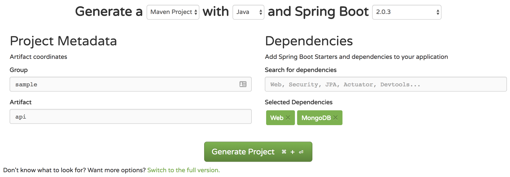

author: Zarin Lokhandwala
summary: How to Design a RESTful Spring Boot API
id: springboot-api
categories: spring-boot, springboot, restful-api, rest-api, api, mongodb, swagger, swagger-ui
environments: java
status: published
Feedback Link: https://zarin.io

# How to Design a RESTful Spring Boot API
<!-- ---------------------------------------------------------------------------------------------------------------- -->
## Overview
Duration: 5

### What you'll learn
- How to design an API using OpenAPI Spec (Swagger Framework)
- How to scaffold a Java Spring API project
- How to configure application properties, web security and Swagger
- How to run and connect to MongoDB locally (stretch goal: establish remote MongoDB cluster)


<!-- ---------------------------------------------------------------------------------------------------------------- -->
## Software and Apps
Duration: 20

#### Software

| Name | Version | Required | MacOS Guide | Notes
| --- | --- | --- | --- | --- |
| Name | Version | Required | MacOS Guide | Notes
| [Git](https://git-scm.com/) | latest | true | [Install git via Homebrew](https://formulae.brew.sh/formula/git#default) | The installation package typically installs both Git and Git Bash. |
| [OpenJDK](https://www.oracle.com/java/technologies/javase-downloads.html) | 16.0.1 | true | [How to setup openjdk via Homebrew](https://johnathangilday.com/blog/macos-homebrew-openjdk/) | If you are using an older version of openjdk (minimum v11+), you can still run this project by either setting **VM options** in the Run Config or appending the following to the bash command below: `-Djdk.tls.client.protocols=TLSv1.2`
| [Apache Maven](https://maven.apache.org/download.cgi) | 3.5.3 | true | [Install maven via Homebrew](https://formulae.brew.sh/formula/maven) | [Understanding Apache Maven - The Series](https://cguntur.me/2020/05/20/understanding-apache-maven-the-series/) 
| [MongoDB](https://www.mongodb.com/download-center#community) | 4.2 | false | [Install mongodb-community@4.2 via Homebrew](https://docs.mongodb.com/manual/tutorial/install-mongodb-on-os-x) | Use an embedded version of MongoDB. More info under the database related sections.

#### Applications

| Type | OS | Options
| --- | --- | --- | 
| Type | OS | Options
| Bash Emulator | MacOS | Native Terminal, [iTerm2](https://iterm2.com/) | 
| Bash Emulator | Windows | [Native Bash for Windows 10](https://www.laptopmag.com/articles/use-bash-shell-windows-10), [Git Bash](https://git-scm.com/downloads), [Cmder](https://cmder.net/) | 
| IDE | MacOS, Windows | [IntelliJ](https://www.jetbrains.com/idea/) | 

#### Subscriptions

- Optional - Retrieve an API subscription key from: [Latest Stock API](https://rapidapi.com/suneetk92/api/latest-stock-price/)

Positive
: A sample key to the API above will be provided, if you don't want to create a subscription. 

<!-- ---------------------------------------------------------------------------------------------------------------- -->
## API Endpoints Explained
Duration: 2

For this codelab, we will design and develop five RESTful API endpoints. The API will have a service class that calls an external stock API to populate a MongoDB, which the five endpoints will interact with. The API contract will contain the following resource methods:

| Endpoint | Implementation |
| --- | --- |
| Get all stock objects | **GET** `/stocks` |
| Get a single stock object | **GET** `/stocks/{symbol}` |
| Create a new stock object | **POST** `/stocks/{symbol}` |
| Update a stock object | **PUT** `/stocks/{symbol}` |
| Delete a stock object | **DELETE** `/stocks/{symbol}` |

<!-- ---------------------------------------------------------------------------------------------------------------- -->
## Spec Driven Development
Duration: 3

Ideal software development occurs in two distinct phases:
1. The creation of a Spec
2. Development of code to match the Spec 

Spec Driven Development is the process of generating a concise spec that can be used to describe your application's interactions in a pragmatic way. In other words, the Spec is a blueprint for your application, detailing how the user interacts with it, rather than just expected behaviors/results. In order to be successful with Spec Driven Development, the Spec must be:
1. **Standardized**: Use of a standard Spec related to the type of application you are building 
2. **Consistent**: The Spec should remain consistent throughout in operations, utlizing consistent design patterns
3. **Tested**: Agile development of the Spec, incorporating repeated user feedback with long-term focus in mind 
4. **Concrete**: The creation of a complete, foundational Spec to be used for your application 
5. **Immutable**: Coding to the Spec without deviation 
6. **Persistent**: The Spec is not changed without strong reason and careful testing 

### Specs Available 

- [RAML](https://raml.org/)
- [API Blueprint](https://apiblueprint.org/)
- [Swagger](https://swagger.io/) (renamed to [OpenAPI Spec](https://github.com/OAI/OpenAPI-Specification))

We will be utilizing Swagger framework to design, produce, visualize, and consume our RESTful service. It provides a programming language-agnostic interface, which allowed both humans and computers to discover and understand the capabilities of a service without requiring access to source code. 

✅Move on to the next step to start building your API Spec!

<!-- ---------------------------------------------------------------------------------------------------------------- -->
## Create the Spec (Pt I)
Duration: 15

An OpenAPI spec can be written in either JSON or YAML. We will be using YAML for this code lab. 

You can use the online swagger editor: [editor.swagger.io](https://editor.swagger.io/)

For this code lab, we are going to create a simple Stocks API that will help manage data in a MongoDB.

Open up any [text editor](https://kinsta.com/blog/best-text-editors/), like Sublime or Notepad++, and create a file called `openapi.yaml`.

Let's begin with the basic `info` block at the start of the file. 

### Info

```yaml
openapi: 3.0.3
info:
  title: Stock API
  description: Sample Java Spring Boot API using MongoDB Atlas
  contact:
    name: Zarin Lokhandwala
    url: https://github.com/zarinlo
  version: 2.0.0
servers:
- url: http://localhost:8080
  description: Inferred Url
tags:
- name: stock-controller
  description: Stock Controller
```

Now let's break it down: 

| Metadata | Details |
| --- | --- |
| `openapi` | The version of the OpenAPI spec you are using (i.e. 3.0.3) |
| `info` | The info block contains important meta-details regarding your API |
| `version` | The version of the API being developed, which should follow [Semantic Versioning](https://semver.org). Semantic versioning consists of three digits, the first numnber indicating the **major** version of an application, the next number is known as **minor** which indicates any features that have been added, and the last number indicates the **patch** fix that has been applied. The **major** number is what is actually taken into consideration when determining the base path of an API. |
| `url` | The URL that is hosting/serving the API. More than one entry can be made under the `servers` section. 
| `tags` | Tags are used to group or categorize operations together for a specific reason. 

Let's add the first REST endpoint definition: **GET** `/stocks` endpoint.

Before we do so, we must define the schemas for the request and response objects from the Latest Stock API (reference the Overview slide for more details) inventory.

Insert this directly after the `tags` section. 

### Stock Object

```yaml
components:
  schemas:
    Stock:
      title: Stock
      type: object
      properties:
        dayHigh:
          type: number
          format: double
        dayLow:
          type: number
          format: double
        identifier:
          type: string
        lastPrice:
          type: number
          format: double
        lastUpdateTime:
          type: string
        open:
          type: number
          format: double
        previousClose:
          type: number
          format: double
        symbol:
          type: string
        totalTradedValue:
          type: number
          format: double
        totalTradedVolume:
          type: integer
          format: int64
        yearHigh:
          type: integer
          format: int64
        yearLow:
          type: integer
          format: int64
```

In the code block above, we are defining the Stock object that has a number of attributes. 

Under the `properties` tag, each attribute is given a `type` and a `format`. You can elaborate on the types and formats, just do a quick google search. 

Now let's take a step back. APIs, typically, produce and consume the `Content-Type` known as JSON. The `/stocks` endpoint should, therefore, return a JSON response object. Furthermore, in this case, an array of stock objects. 

The correct way to return to return all the stock objects, according to REST, is to return an object encompassing an array of objects:

```json
{
  "stocks": [
    {},
    {},
    {}
  ]
}
```

The incorrect way to return all the stock objects is to return a top-level array:

```json
[
  {},
  {},
  {}
]
```

An important rule in REST is to design a consistent API spec. To return either a stock object or a collection of stock objects, we define a general response object. 

The response object will encompass any response data type and deliver it back to the user in a standard format. 

When defining the general object, do so under the `schemas` section of the YAML and ensure the indentation is precise, since YAML files are senstiive. 

### Stock General Response

```yaml
components:
  schemas:
...
    StockGeneralResponse:
      title: StockGeneralResponse
      type: object
      properties:
        response:
          type: object
        status:
          type: string
          enum:
          - ACCEPTED
          - BAD_GATEWAY
          - BAD_REQUEST
          - CREATED
          - NOT_FOUND
          - NO_CONTENT
          - OK
        userMessages:
          uniqueItems: true
          type: array
          items:
            type: string
```

This response object has three main attributes:

| Metadata | Details |
| --- | --- |
| `response` | This is the actual response encompassed by the general object. Ergo a stock object or a collection of stock objects. |
| `status` | The HTTP status that was returned by the underlying service responsible for the data. An `enum` is a special "class" that represents a group of constants (unchangeable variables, like final variables). |
| `userMessages` | This is used to deliver a string of messages back to the user to provide additional information incase an error occurs.  |

✅Move on to the next step to add the API endpoints.

<!-- ---------------------------------------------------------------------------------------------------------------- -->
## Create the Spec (Pt II)
Duration: 10

Now we are ready to implement the GET `/stocks` method. We are going to insert this portion between the basic `info` block we created and the `components` block.

### GET `/stocks`

```yaml
paths:
  "/api/v1/stocks":
    get:
      tags:
      - stock-controller
      summary: Get all stocks
      operationId: getAllStocks
      responses:
        '200':
          description: 'Successful: Stock(s) found.'
          content:
            application/json:
              schema:
                "$ref": "#/components/schemas/StockGeneralResponse"
        '400':
          description: 'Bad Request: Check input parameter(s) syntax for invalid characters.'
        '401':
          description: 'Unauthorized: User is not entitled to retrieve information.'
        '404':
          description: 'Not Found: Stock(s) not found.'
        '500':
          description: 'Internal Server Error: Backend service is down.'
```

Once again, here's the breakdown of the keys:

| Metadata | Details |
| --- | --- |
| `paths` | This is where you specify the **base** + **context** path, essentially the full endpoint. The base path is `/api/v1` (more details later) and the context is `/stocks`. |
| `get` | The CRUD operation being applied to a given path. |
| `summary` | Short description of the function. |
| `operationId` | The actual name of the function you are going to use in your source code, in this case, `getAllStocks`. |
| `responses` | A list of possible HTTP status codes returned by the server as a response to the client. Take a look at [HTTP status codes](https://httpstatuses.com/) to understand which HTTP numeric response is appropriate for a given scenario. |
| `content` | Content type to be returned to the user is in the form of JSON, denoted as `application/json`. |
| `schema` |  Sets the data-type of the content being returned by the function. A method will not always return content. For instance, `DELETE`, does not return any content back to the client since data has been removed, unless you save it as a temporary variable before deleting the actual item/object. Notice how the `$ref` tag points to the `StockGeneralResponse` definition under the `components` section, this relates back to the premise of not returning a top-level array. |

Now, under the endpoint of `/api/v1/stocks`, we are implementing a `GET` operation and a `POST` operation.

Here is how we are going to define a `post` operation, which should be aligned under the `get` defintion we completed above. 

### POST `/stocks`

```yaml
paths:
  "/api/v1/stocks":
...
    post:
      tags:
      - stock-controller
      summary: Create a new stock
      operationId: createStock
      requestBody:
        content:
          application/json:
            schema:
              "$ref": "#/components/schemas/Stock"
      responses:
        '200':
          description: 'Successful: Stock(s) found.'
          content:
            application/json:
              schema:
                "$ref": "#/components/schemas/StockGeneralResponse"
        '400':
          description: 'Bad Request: Check input parameter(s) syntax for invalid characters.'
        '401':
          description: 'Unauthorized: User is not entitled to retrieve information.'
        '404':
          description: 'Not Found: Stock(s) not found.'
        '500':
          description: 'Internal Server Error: Backend service is down.'
```

When creating an object via a `POST` operation, the client passes the server some data. 

Some forms of how a client can pass data to the server are: 

| Type | Example |
| --- | --- |
| a query parameter | Any value assigned to a key after the `?` in a URL, for example: `https://example.com/movies?genre=comedy` |
| a path parameter | `/api/v1/cars/german/{make}/models` where the endpoint will return all the models given a `make` of a German brand |
| an object sent via the body of a request | `{ .. }` |
| a Header value  | `Authorization: Value` |
| a browser cookie 🍪 | Logins, shopping carts, game scores, or anything else the server should remember |


In this case, the `POST` will be performed with a stock object via the body of the request. 

Therefore, the `requestBody` is the main difference between the attributes used to describe the `POST` operation as compared to the `GET`.

👉🏽 To learn more about parameter types, check out the [Describing Parameters](https://swagger.io/docs/specification/describing-parameters) page. 

This concludes the spec for the CRUD operations that can be performed under the `/api/v1/stocks` endpoint. 

✅Move on to the next step to complete your API spec.

<!-- ---------------------------------------------------------------------------------------------------------------- -->
## Create the Spec (Pt III)
Duration: 10

Let's implement the remaining three endpoints that follow the path of: `/api/v1/stocks/{symbol}`

### GET | PUT | DELETE `/stocks/{symbol}`

```yaml
paths:
...
  "/api/v1/stocks/{symbol}":
    get:
      tags:
      - stock-controller
      summary: Get a stock by symbol
      operationId: getStockBySymbol
      parameters:
      - name: symbol
        in: path
        description: A stock symbol
        required: true
        style: simple
        allowReserved: false
        schema:
          type: string
      responses:
        '200':
          description: 'Successful: Stock(s) found.'
          content:
            application/json:
              schema:
                "$ref": "#/components/schemas/StockGeneralResponse"
        '400':
          description: 'Bad Request: Check input parameter(s) syntax for invalid characters.'
        '401':
          description: 'Unauthorized: User is not entitled to retrieve information.'
        '404':
          description: 'Not Found: Stock(s) not found.'
        '500':
          description: 'Internal Server Error: Backend service is down.'
    put:
      tags:
      - stock-controller
      summary: Update an existing stock by symbol
      operationId: updateStockBySymbol
      parameters:
      - name: symbol
        in: path
        description: A stock symbol
        required: true
        style: simple
        schema:
          type: string
      - name: lastPrice
        in: query
        description: Last Price
        required: true
        style: form
        schema:
          type: number
          format: double
      responses:
        '200':
          description: 'Successful: Stock(s) found.'
          content:
            application/json:
              schema:
                "$ref": "#/components/schemas/StockGeneralResponse"
        '400':
          description: 'Bad Request: Check input parameter(s) syntax for invalid characters.'
        '401':
          description: 'Unauthorized: User is not entitled to retrieve information.'
        '404':
          description: 'Not Found: Stock(s) not found.'
        '500':
          description: 'Internal Server Error: Backend service is down.'
    delete:
      tags:
      - stock-controller
      summary: Delete a stock by symbol
      operationId: deleteStockBySymbol
      parameters:
      - name: symbol
        in: path
        description: A stock symbol
        required: true
        style: simple
        schema:
          type: string
      responses:
        '200':
          description: 'Successful: Stock(s) found.'
          content:
            application/json:
              schema:
                "$ref": "#/components/schemas/StockGeneralResponse"
        '400':
          description: 'Bad Request: Check input parameter(s) syntax for invalid characters.'
        '401':
          description: 'Unauthorized: User is not entitled to retrieve information.'
        '404':
          description: 'Not Found: Stock(s) not found.'
        '500':
          description: 'Internal Server Error: Backend service is down.'
```

Take a look at how the paths are defined for `/api/v1/stocks` and `/api/v1/stocks/{symbol}`. You will notice that they are surrounded by quotes. In YAML, enclosing characters in quotes ensures that it will be handled as a `string`.

Each of the operations above will require a `path` parameter denoted as:

```yaml
in: path
``` 

For the rest of the items, refer to the link presented earlier: [Describing Parameters](https://swagger.io/docs/specification/describing-parameters) 

- <a href="../elements/assets/springboot-api/openapi.yaml" style download>Download the full OpenAPI Spec YAML</a>

- <a href="../elements/assets/springboot-api/openapi.json" style download>Download the full OpenAPI Spec JSON</a>

🚀 You've completed your first basic API spec! Now let's start by scaffolding (i.e. structuring) your Spring Boot project. 

<!-- ---------------------------------------------------------------------------------------------------------------- -->
## Scaffold Spring API Project
Duration: 3

A tool that scaffolds your web project for you is a tool that helps you kickstart new projects, which presecribes best practices and folder structure to help you stay productive. We will use Spring Initialzr to scaffold your basic Spring boot API.

### Using Spring Initialzr

Spring Initialzr can be accessed via a web UI or through your IDE (i.e. IntelliJ/Eclipse). It generates a minimal project with the dependencies of your choice and enables you to start developing quickly. 

- Navigate to the web UI Spring Initialzr: [https://start.spring.io](https://start.spring.io)
- Fill in the following: Generate a **Maven Project** with **Java v16** and Spring Boot **2.5.2**
- Fill in the project details: 

| Type | Example |
| --- | --- |
| Group | sample |
| Artifact | api |
| Name | Stocks API |
| Description | Sample Java Spring Boot API using MongoDB Atlas |
| Package name | sample.api |
| Packaging | Jar |

- In the Dependencies sections add: **Spring Web**, **Spring Data MongoDB**, and **Embedded MongoDB Database**
- Click **Generate Project** and a download should start for the project. 



<!-- ---------------------------------------------------------------------------------------------------------------- -->
## API Project Structure
Duration: 2

Before we begin developing our API, let's setup the structure of the project correctly. Once you extract the initial zip file from the previous step, ensure your directory structure looks like the following: 

```
|api
  |-src
  |  |-main
  |  |  |-java
  |  |  |  |-sample
  |  |  |  |  |-api
  |  |  |-resources
  |  |  |  |-static
  |  |  |  |-templates
  |  |-test
```

You should rename the initial **api** folder to something else, for instance, **sample-springboot-api**.

```
|sample-springboot-api
  |-src
  |  |-main
  |  |  |-java
  |  |  |  |-sample
  |  |  |  |  |-api
  |  |  |-resources
  |  |  |  |-static
  |  |  |  |-templates
  |  |-test
```

Now, let's create the other directories that we will need going further. 

```
|sample-springboot-api
  |-src
  |  |-main
  |  |  |-java
  |  |  |  |-sample
  |  |  |  |  |-api
  |  |  |  |  |  |-stocks
  |  |  |  |  |  |  |-repositories
  |  |  |  |  |  |  |-models
  |  |  |  |  |  |  |-exceptions
  |  |  |  |  |  |  |-configs
  |  |  |  |  |  |  |-controllers
  |  |  |  |  |  |  |-services
  |  |  |-resources
  |  |  |  |-static
  |  |  |  |-templates
  |  |-test
```

### Base Project Structure
- Under the **api** folder is where you want to create another directory specifically for **stocks**. This is so that down the line if you want to develop another API that's not related to stocks, then you can use the same project and keep things organized. 
- You can either go directly into the **stocks** folder or you can add a **v1** folder in-between the two. So for example, the structure would be **api** > **v1** > **stocks**, and this helps if you are planning on maintaining multiple versions of your API down the line. 

### API Project Structure

Let's breakdown the folders under **stocks**: 

| Component | Details |
| --- | --- |
| controllers | Manages all the REST calls and status codes |
| services | The business logic layer that handles any manipulation of data required |
| repositories |ses a Java Persistence API (JPA) that analyzes all the methods defined by an interface and automatically generates queries from the method names, in order to simplify the connection to the database from the Service layer |
| configs | Sets up the configurations for the REST calls, web security, Swagger documentation, etc |
| models | Manages all the REST calls and status codes |
| exceptions | Develop custom error handling for the application |

<!-- ---------------------------------------------------------------------------------------------------------------- -->
## Configure Maven Settings
Duration: 4

Apache Maven, referred to as maven, is a build management tool that is primarily used to build Java projects. 

To learn more, check out: [Understanding Apache Maven - The Series](https://cguntur.me/2020/05/20/understanding-apache-maven-the-series/)

Now before we import your project into an IDE, specifically IntelliJ for this tutorial, let's configure your maven settings. 

Verify that maven is installed correctly by running the following:

```bash
 05:00PM ~/.m2  
🦋 mvn --version 
Apache Maven 3.5.3 (3383c37e1f9e9b3bc3df5050c29c8aff9f295297; 2018-02-24T14:49:05-05:00)
Maven home: /opt/apache-maven-3.5.3
Java version: 16.0.1, vendor: Homebrew
```

Next, you will need to inlcude a `settings.xml` file directly under your **.m2** folder. Your **.m2** folder should located under your user home directory, as shown in the snippet above. 

The `settings.xml` file does not need anything in specific for the time being, the stock file is good enough. 

This file has metadata that is used by maven to install dependencies, understand which mirrors (i.e public repositories) to download said dependencies from, set proxies to circumvent firewalls, etc. 

➡️ <a href="../elements/assets/springboot-api/settings.xml" style download>Download settings.xml file</a>

More information on a default `settings.xml` file here: [Apache Maven Settings](https://maven.apache.org/settings.html)

<!-- ---------------------------------------------------------------------------------------------------------------- -->
## Import API Project
Duration: 5

If you are using IntelliJ, import your project as a Maven project. You can run through the following to make sure your project has been imported and configured correctly. 

### Import Project
Import the project as a Maven project. Continue through the wizard and let all the dependencies load, which may take some time. 
- Reference: [Importing a Maven Project](https://www.jetbrains.com/help/idea/maven-support.html#maven_import_project_start)

<!--  -->

### Verify Maven Build Repository
Under **Preferences** OR **File** --> **Settings**, go to **Build, Execution. Deployment** --> **Build Tools** --> **Maven**, and make sure the remote repository URLs are being pulled from your `settings.xml` file.
- Reference: [Maven. Repositories](https://www.jetbrains.com/help/idea/maven-repositories.html)


### Set Project SDK
Under **File** --> **Project Structure** --> **Project**, make sure that you set your project SDK to java1.8 or java1.10. 
- Reference: [Working with SDKs](https://www.jetbrains.com/help/idea/sdk.html)

### Setup Run Configurations
In order to run your project, go ahead and setup a **Spring Boot** run configuration. 
- Reference: [Creating and Editing Run/Debug Configurations](https://www.jetbrains.com/help/idea/creating-and-editing-run-debug-configurations.html)

### Reimport Project (if needed)
Once you have imported the project, there may be times where you need to reimport depenedencies incase you add/change/remove dependencies. Press `Ctrl`+`Shift`+`A` to find actions, and input "reimport", you will find the "Reimport All Maven Projects". On a Mac, use ⌘ + ⇧ + A instead.


### Synchronize Project (if needed)
To synchronize your project, right-click on the project folder and hit Synchronize. You can also do this from the maven projects tool window. 

- Reference: [Maven Projects Tool Window](https://www.jetbrains.com/help/idea/maven-projects-tool-window.html)

✅Continue on to the next step to start creating the Object model classes for a Stock as we defined in our API Spec. 

<!-- ---------------------------------------------------------------------------------------------------------------- -->
## Create API Object Models
Duration: 8

Create a class called `Stock.java` under the **models** package (i.e. directory) with the following attributes:
- `double` dayHigh
- `double` dayLow
- `String` identifier
- `double` lastPrice
- `String` lastUpdateTime
- `double` open
- `double` previousClose
- `String` symbol
- `double` totalTradedValue
- `long` totalTradedVolume
- `long` yearHigh
- `long` yearLow

You will need to Generate getters and setters for this Object class so that you can access and modify the objects as needed. Under **Code** --> **Generate** select **Getter and Setter** and select all the attributes to generate them for. Repeat the same steps to generate a Constructor as well. 

### `Stock.java`

```java
import org.springframework.data.annotation.Id;
import org.springframework.data.mongodb.core.mapping.Document;

public class Stock {
    public double dayHigh;
    public double dayLow;
    public String identifier;
    public double lastPrice;
    public String lastUpdateTime;
    public double open;
    public double previousClose;
    public String symbol;
    public double totalTradedValue;
    public long totalTradedVolume;
    public long yearHigh;
    public long yearLow;

    // generate empty constructor 
    public Stock() {
    }

    public double getDayHigh() {
        return dayHigh;
    }

    public void setDayHigh(double dayHigh) {
        this.dayHigh = dayHigh;
    }

    public double getDayLow() {
        return dayLow;
    }

    public void setDayLow(double dayLow) {
        this.dayLow = dayLow;
    }

    public String getIdentifier() {
        return identifier;
    }

    public void setIdentifier(String identifier) {
        this.identifier = identifier;
    }

    public double getLastPrice() {
        return lastPrice;
    }

    public void setLastPrice(double lastPrice) {
        this.lastPrice = lastPrice;
    }

    public String getLastUpdateTime() {
        return lastUpdateTime;
    }

    public void setLastUpdateTime(String lastUpdateTime) {
        this.lastUpdateTime = lastUpdateTime;
    }

    public double getOpen() {
        return open;
    }

    public void setOpen(double open) {
        this.open = open;
    }

    public double getPreviousClose() {
        return previousClose;
    }

    public void setPreviousClose(double previousClose) {
        this.previousClose = previousClose;
    }

    public String getSymbol() {
        return symbol;
    }

    public void setSymbol(String symbol) {
        this.symbol = symbol;
    }

    public double getTotalTradedValue() {
        return totalTradedValue;
    }

    public void setTotalTradedValue(double totalTradedValue) {
        this.totalTradedValue = totalTradedValue;
    }

    public double getTotalTradedVolume() {
        return totalTradedVolume;
    }

    public void setTotalTradedVolume(long totalTradedVolume) {
        this.totalTradedVolume = totalTradedVolume;
    }

    public long getYearHigh() {
        return yearHigh;
    }

    public void setYearHigh(long yearHigh) {
        this.yearHigh = yearHigh;
    }

    public long getYearLow() {
        return yearLow;
    }

    public void setYearLow(long yearLow) {
        this.yearLow = yearLow;
    }
}
```

Next, we need a class called `StocksList.java` to return an array of stock objects. 

### `StocksList.java`

```java
import java.util.List;

public class StockList {

    List<Stock> stockList;

    public StockList(List<Stock> stockList) {
        this.stockList = stockList;
    }

    public List<Stock> getStockList() {
        return stockList;
    }

    public void setStockList(List<Stock> stockList) {
        this.stockList = stockList;
    }
}
```

Now according to our API spec, we do NOT want to return a top-level array for the **GET** `/api/v1/stocks` endpoint. 

Therefore, we develop a general class called `StocksGeneralResponse.java`. 

### `StockGeneralResponse.java`

```java
import org.eclipse.collections.impl.set.mutable.UnifiedSet;
import org.springframework.http.HttpStatus;

public class StockGeneralResponse<T> {

    private T response;

    private HttpStatus httpStatus;

    private UnifiedSet<String> userMessages = UnifiedSet.newSet();

    public StockGeneralResponse() {
    }

    public StockGeneralResponse(T response, HttpStatus httpStatus) {
        this.response = response;
        this.httpStatus = httpStatus;
    }

    public T getResponse() {
        return response;
    }

    public void setResponse(T response) {
        this.response = response;
    }

    public HttpStatus getHttpStatus() {
        return httpStatus;
    }

    public void setHttpStatus(HttpStatus httpStatus) {
        this.httpStatus = httpStatus;
    }

    public UnifiedSet<String> getUserMessages() {
        return userMessages;
    }

    public void setUserMessages(UnifiedSet<String> userMessages) {
        this.userMessages = userMessages;
    }
}
```

In the code snippet above, you will see the use of `T` which stands for **Template** in this case.

The template allows the `StockGeneralResponse` to encompass any data type delivered by the response into an object, and pass along the HTTP status for that response as well. 

Certain datatypes used in this java class require the addition of Eclipse Collections. Therefore, open up your root `pom.xml` and include:

```xml
<dependencies>
    ...
    <!--Eclipse Collections-->
    <dependency>
        <groupId>org.eclipse.collections</groupId>
        <artifactId>eclipse-collections-api</artifactId>
        <version>${eclipse.collections}</version>
    </dependency>
    <dependency>
        <groupId>org.eclipse.collections</groupId>
        <artifactId>eclipse-collections</artifactId>
        <version>${eclipse.collections}</version>
    </dependency>
    ...
</dependencies>
```

Create or use the pre-existing `<properties>` section at the top of the `pom.xml` file: 

```xml
<properties>
    ...
      <eclipse.collections>10.2.0</eclipse.collections>
</properties>
```

✅Now let's get started on designing our first API endpoint! 

<!-- ---------------------------------------------------------------------------------------------------------------- -->
## Spring Annotations Overview
Duration: 2

Annotations in Java is a special form of metadata that can be embedded in Java source code. Users can use annotations to configure beans inside the java source file itself. 

Here is a full set of all available annotations within the Spring Framework: [Spring Framework Annotations](https://springframework.guru/spring-framework-annotations/)

### Examples of Some Annotations Used

#### @Component
This annotation is used on classes to indicate a Spring component. The `@Component` annotation marks the Java class as a bean or say component so that the component-scanning mechanism of Spring can add into the application context.

#### @Controller
The `@Controller` annotation is used to indicate the class is a Spring controller. This annotation can be used to identify controllers for Spring MVC or Spring WebFlux.

#### @Service
This annotation is used on a class. The `@Service` marks a Java class that performs some service, such as execute business logic, perform calculations and call external APIs. This annotation is a specialized form of the `@Component` annotation intended to be used in the service layer.

#### @Repository
This annotation is used on Java classes which directly access the database. The `@Repository` annotation works as marker for any class that fulfills the role of repository or Data Access Object. This annotation has a automatic translation feature. For example, when an exception occurs in the `@Repository` there is a handler for that exception and there is no need to add a try catch block.

#### @Configuration
This annotation is used on classes which define beans. `@Configuration` is an analog for XML configuration file – it is configuration using Java class. Java class annotated with `@Configuration` is a configuration by itself and will have methods to instantiate and configure the dependencies.

#### @Bean
This annotation is used at the method level. `@Bean` annotation works with `@Configuration` to create Spring beans. As mentioned earlier, `@Configuration` will have methods to instantiate and configure dependencies. Such methods will be annotated with `@Bean`. The method annotated with this annotation works as bean ID and it creates and returns the actual bean.

#### @Value
This annotation is used at the field, constructor parameter, and method parameter level. The `@Value` annotation indicates a default value expression for the field or parameter to initialize the property with.

#### @SpringBootApplication
This annotation is used on the application class while setting up a Spring Boot project. The class that is annotated with the `@SpringBootApplication` must be kept in the base package. 

#### @RestController
This annotation is used at the class level. The `@RestController` annotation marks the class as a controller where every method returns a domain object instead of a view. 

#### @Scheduled
This annotation is a method level annotation. The `@Scheduled` annotation is used on methods along with the trigger metadata. A method with `@Scheduled` should have void return type and should not accept any parameters.

<!-- ---------------------------------------------------------------------------------------------------------------- -->
## Setup Stock Interface
Duration: 5

In Java there is a concept of **interfaces** and **classes**. An interface specifies what a class must do, and not how.

The first interface we are going to define is `StockService.java` and it will be under the **services** folder. Here we declare the behaviors of all the functions for our five main endpoints, which the class will implement. 

Let's review the endpoints: 

| Usage | Function | Implementation |
| --- | --- | --- |
| Usage | Function | Implementation |
| Get all stock objects |`getAllStocks()` | **GET** `/stocks` |
| Get a single stock object | `getStockBySymbol(String symbol)` | **GET** `/stocks/{symbol}` |
| Create a new stock object | `createStock(String symbol)` | **POST** `/stocks/{symbol}` |
| Update [the price of] a stock object | `updateStock(String symbol, Double lastPrice)` | **PUT** `/stocks/{symbol}` |
| Delete a stock object | `deleteStock(String symbol)` | **DELETE** `/stocks/{symbol}` |

This is what our interface looks like: 

### `StockService.java`

```java
import sample.api.stocks.exceptions.StocksResponseException;
import sample.api.stocks.models.Stock;
import sample.api.stocks.models.StockGeneralResponse;

public interface StockService {

    StockGeneralResponse getAllStocks();
    void populateStockDatabase();
    StockGeneralResponse getStockBySymbol(String symbol);
    StockGeneralResponse createStock(Stock stock);
    StockGeneralResponse updateStock(String symbol, Double lastPrice);
    StockGeneralResponse deleteStock(String symbol);
}
```

- We are returning the object `StockGeneralResponse` for each endpoint, even for the `DELETE` operation, which typically returns no content. More on this later. 

- We have a `populateStockDatabase()` function that will help us populate our database and keep it updated at a given frequency.

- The rest are self explanatory. 

Negative
: Comment out every function but the `populateStockDatabase()` one, because the IDE will complain about any function that has been defined in the interface, that does not have a proper implementation. 

<!-- ---------------------------------------------------------------------------------------------------------------- -->
## Steps to Consume External API
Duration: 2

First, let's populate the data so that we have some data to manipulate.

We are going to work on writing the `populateStockDatabase()`. This function will be defined in a new class called, `StockServiceImpl.java`, which is the implementation of the interface we just created.

Before we get started, we are going to have to do the following: 
✔️ create a subscription to the API that is going to provide the data 
✔️ test the connection to the API via cURL (or another REST client, like Postman or Insomnia)
✔️ create a java `repository` that will read from a MongoDB 
✔️ create an application properties file in java to store the credentials needed to access the API 
✔️ setup a REST template that will connect to the API (optional, but recommended)
✔️ setup an exception handler to deal with failed responses from the API (optional, but recommended)
✔️ develop the `populateStockDatabase()` function to call the external API and populate the database

<!-- ---------------------------------------------------------------------------------------------------------------- -->
## Subcribe and Test API via Postman
Duration: 5

### Create Subscription 

To make things easier, I have created a subscription and have retrieved a sample key from the [Latest Stock API](https://rapidapi.com/suneetk92/api/latest-stock-price/).

### Test Connection via Postman

Here are some points you will need to know about consuming the API: 

| Key | Value | Notes
| --- | --- | --- |
| Key | Value | Notes
| Invocation URL | `https://latest-stock-price.p.rapidapi.com` | In our project we will configure this URL to be used with a REST template just for consuming stock data. 
| API Key |`x-rapidapi-key: 9e87a2c143msh6b92309e36af212p15ccc6jsn2bc37ea481bd` | This will be passed in as a header in the API request.
| Path | `/price` | This is the path to view the prices for a specific stock index. 
| Query Parameter | `Indices=<SOME-VALUE-HERE>` | The API requires the `Indicies` query parameter to be passed in an accepted value, such as `NIFTY NEXT 50`, found in the API docs for **Latest Stock API**.

To make a test call to this API, we are going to use Postman. 

[Postman](https://www.postman.com/product/rest-client/) is an API client that makes it easy for developers to create and save simple and complex HTTP/s requests, as well as read their responses. The result - more efficient and less tedious work.

In Postman, setup a simple `GET` request with the following values to target: 
```
https://latest-stock-price.p.rapidapi.com/price?Indices=NIFTY NEXT 50
```

Hit the **Send** button and your response should look as followed: 


```json
[
    {
        "symbol": "NIFTY NEXT 50",
        "identifier": "NIFTY NEXT 50",
        "open": 38759.15,
        "dayHigh": 38846.85,
        "dayLow": 38684.95,
        "lastPrice": 38697.7,
        "previousClose": 38678.15,
        "change": 19.549999999995634,
        "pChange": 0.05,
        "yearHigh": 39399.6,
        "yearLow": 25614.15,
        "totalTradedVolume": 28602611,
        "totalTradedValue": 7654580126.95,
        "lastUpdateTime": "30-Jun-2021 09:29:14",
        "perChange365d": 50.15,
        "perChange30d": 3.43
    },
    { ... }
]
```

<!-- ---------------------------------------------------------------------------------------------------------------- -->
## Setup Stock Repository for MongoDB
Duration: 5

In order to interact with MongoDB, we will be using the Spring Framework MongoDB data repository. Spring data repositories simplify the amount of code required to implement data access layers for various persistence stores. 

All that's required to get this working is to create an **interface** that extends the Spring MongoDB repository. So let's create a `StockRepository.java` interface that `extends` the `MongoRepository`, under the **repositories** package/directory. We want to annotate this persistence layer with `@Repository`, which again, is a stereotype annotation applied to data access layers that are used to get data from the database. 

Out-of-the-box, this interface comes with many operations, including standard CRUD (create-read-update-delete) operations. Spring has its' own [query builder mechanism](https://docs.spring.io/spring-data/jpa/docs/current/reference/html/#repositories.query-methods.query-creation) and the `findAll` method is already provided by default, so for now, we will leave this interface empty of additional queries. 

When you extend the interface, the `<Stock, String>` implies that the MongoDB will contain stock objects, stored as strings. 

### `StockRepository.java`
```java
import org.springframework.data.mongodb.repository.MongoRepository;
import org.springframework.stereotype.Repository;
import sample.api.stocks.models.Stock;

@Repository
public interface StockRepository extends MongoRepository<Stock, String> {

}
```

Let's take a quick step back and go back to the `Stock.java` object model class. You are going to annotate the **symbol** attribute with `@Id`. This tells the MongoDB that we want map the `_id` field in mongo to the stock **symbol**, which is essentially the unique identifier for each object in the databse. 

You are also going to annotate the whole class with `@Document` to define the name of the document collection where the data should be stored within the MongoDB database. 

### `Stock.java`
```java
import org.springframework.data.annotation.Id;
import org.springframework.data.mongodb.core.mapping.Document;

@Document(collection = "stocks")
public class Stock {
    ...
    @Id
    public String symbol;
    public double totalTradedValue;
    public long totalTradedVolume;
    public long yearHigh;
    public long yearLow;
    ...
}
```

<!-- ---------------------------------------------------------------------------------------------------------------- -->
## Setup REST Template
Duration: 5

In order to connect to the **Latest Stock API** we will create an application properties file to manage the configuration items. The `application.yaml` file will be created under the **resources** directory. 

### `application.yaml`

```yaml
# stocks api
stocks:
  api:
    fqdn: https://latest-stock-price.p.rapidapi.com
```

- `fqdn` stands for fully qualified domain name 🤓

Now, under the **configs** folder, create a class called `RestTemplateConfig.java`. This template will help establish a connection to the **Latest Stock API** at application runtime. 

### `RestTemplateConfig.java`

```java
package sample.api.stocks.configs;

import org.springframework.beans.factory.annotation.Qualifier;
import org.springframework.beans.factory.annotation.Value;
import org.springframework.context.annotation.Bean;
import org.springframework.context.annotation.Configuration;
import org.springframework.web.client.RestTemplate;
import org.springframework.web.util.DefaultUriBuilderFactory;

@Configuration
public class RestTemplateConfig {

    @Value("${stocks.api.fqdn}")
    private String stocksApiUrl;

    @Bean
    @Qualifier("stocksApiRestTemplate")
    public RestTemplate stocksApiRestTemplate() throws Exception {
        RestTemplate restTemplate = new RestTemplate();
        restTemplate.setUriTemplateHandler(new DefaultUriBuilderFactory(this.stocksApiUrl));
        return restTemplate;
    }
}

```

Let's go over some things in this configuration class: 
- The java class is annotated with `@Configuration`, which is a configuration by itself and will have methods to instantiate and configure the dependencies.
- The `@Value` tells the project to initialize the `string` property `stocksApiUrl` with an item found in the `application.yaml` file that follows the hierarchy of: **stocks** > **api** > **fqdn**. If this variable is not found, the application will not start up. 
- We pass the `stocksApiUrl` to the template handler to establish a connection with the stock API.

<!-- ---------------------------------------------------------------------------------------------------------------- -->
## Setup Exceptions
Duration: 4

When an error occurs within any of our methods, the method will create an object and hand it off to the runtime system. The object, called an exception object, contains information about the error, including its type and the state of the program when the error occurred. Creating an exception object and handing it to the runtime system is called throwing an exception. More here: [Oracle: Java Tutorials - Exceptions](https://docs.oracle.com/javase/tutorial/essential/exceptions/definition.html)

Now when an appropriate handler is found, the runtime system passes the exception to the handler. An exception handler is considered appropriate if the type of the exception object thrown matches the type that can be handled by the handler. The exception handler chosen is said to catch the exception.

Let's start by creating a simple exception class under the **exceptions** folder. 

### `StockResponseException.java`

```java
public class StocksResponseException extends Exception {

    public StocksResponseException(String message) {
        super(message);
    }
}
```

This is a pretty standard exception class defined in java. 

We will take it a step further by creating an exception handler as well. More on this later.

<!-- ---------------------------------------------------------------------------------------------------------------- -->
## Setup Stock Service to Call External API 
Duration: 10

At this point we have setup all the items needed to make this rest call to the external API. Let's break down how we are going to do this by creating the following class under the **services** folder.

### `StockServiceImpl.java`

```java 
import org.eclipse.collections.impl.list.mutable.FastList;
import org.springframework.beans.factory.annotation.Qualifier;
import org.springframework.core.ParameterizedTypeReference;
import org.springframework.http.*;
import org.springframework.scheduling.annotation.Scheduled;
import org.springframework.stereotype.Service;
import org.springframework.web.client.RestTemplate;
import org.springframework.web.util.UriComponentsBuilder;
import sample.api.stocks.exceptions.StocksResponseException;
import sample.api.stocks.models.*;
import sample.api.stocks.repositories.StockRepository;

import java.util.Objects;

// annotation which marks a Java class that executes business logic, perform calculations and calls external APIs
@Service 
public class StockServiceImpl implements StockService {

    // define local variable to call the stock repository (i.e. MongoDB)
    private final StockRepository stockRepository;

    // define local var that will perform the connection to the external API
    private final RestTemplate stocksApiRestTemplate;

    // define local var to pass the API key via headers 
    private final HttpHeaders httpHeaders;

    public StockServiceImpl(
      // the @Qualifier annotation will ensure that the correct REST template is being instantiated in the constructor 
      @Qualifier("stocksApiRestTemplate") RestTemplate stocksApiRestTemplate,
                            StockRepository stockRepository) {
        this.stocksApiRestTemplate = stocksApiRestTemplate;
        this.stockRepository = stockRepository;

        // instantiating headers and passing in the API key to the header name "x-rapidapi-key", which can be found in the API documentation
        httpHeaders = new HttpHeaders();
        httpHeaders.add("x-rapidapi-key", "9e87a2c143msh6b92309e36af212p15ccc6jsn2bc37ea481bd");
    }

    //---------------------------------------------------------------------------------------------------------------

    // annotation is used to trigger this request once a minute, time in seconds
    @Scheduled(fixedRate = 60000)
    public void populateStockDatabase() throws StocksResponseException {
        // the path that needs to be called once the rest template intializes a connection with the API 
        String path = "/price";

        // a query parameter was required to be passed to the path above, and we utilize a query builder object where "Indices=NIFTY%20NEXT%2050" is the encoded value 
        UriComponentsBuilder builder = UriComponentsBuilder
                .fromUriString(path)
                .queryParam("Indices", "NIFTY NEXT 50");

        // a FastList is an attempt to provide the same functionality as ArrayList without the support for concurrent modification exceptions
        // we set the type of data that will be collected in this FastList, i.e. Stock 
        // we use the rest template and apply the "exchange" function to it 
        // the exchange method takes in the builder object which will result in --> /price?Indices=NIFTY%20NEXT%2050
        // we pass in the CRUD operation as GET and pass in the headers that were previously instantiated
        ResponseEntity<FastList<Stock>> response = stocksApiRestTemplate.exchange(builder.build().toString(), HttpMethod.GET, new HttpEntity<>(httpHeaders), new ParameterizedTypeReference<FastList<Stock>>() {
        });

        // if the response status is a 200 or OK...
        if (response.getStatusCode() == HttpStatus.OK) {
            // we ensure that the response is not null, and then save the body of the response object into our database via the stock respository's default given method, save()
            Objects.requireNonNull(response.getBody()).forEach(stockRepository::save);
        } else {
            // if an issue occurs, we throw an exception with a specific error message, in String format
            throw new StocksResponseException("Error: Issue retrieving stocks.");
        }
    }
}
```

Since we decided to throw exceptions within our `StockServiceImpl.java` class, therefore, we need to update our interface class to reflect the same.  

### `StockService.java`
```java
public interface StockService {

    StockGeneralResponse getAllStocks();
    void populateStockDatabase() throws StocksResponseException; // throws exception
    StockGeneralResponse getStockBySymbol(String symbol);
    StockGeneralResponse createStock(Stock stock);
    StockGeneralResponse deleteStock(String symbol);
    StockGeneralResponse updateStock(String symbol, Double lastPrice) throws StocksResponseException; // throws exception
}
```

Finall, navigate to the main Spring Boot application class. In order to trigger the `populateStockDatabase()` function at a scheduled rate, we must annoate the main class with `@EnableScheduling`.

### `ApiApplication.java`

```java
import org.springframework.boot.SpringApplication;
import org.springframework.boot.autoconfigure.SpringBootApplication;
import org.springframework.scheduling.annotation.EnableScheduling;

@EnableScheduling
@SpringBootApplication
public class ApiApplication {

	public static void main(String[] args) {
		SpringApplication.run(ApiApplication.class, args);
	}
}
```

<!-- ---------------------------------------------------------------------------------------------------------------- -->
## GET /stocks
Duration: 3

Now that you have setup the service that is going to populate the database, let's build a service that will retrieve all the records from the database, i.e. `getAllStocks()`.

In the service implementation class, define the following function. 

### `StockServiceImpl.java`

```java
    public StockGeneralResponse getAllStocks() {
        return new StockGeneralResponse(stockRepository.findAll(), HttpStatus.OK);
    }
```

All we are doing is calling the stock repository's `findAll` method, which is one of the default methods provided by the JPA's as stated in the **Setup Stock MongoDB Repository** section. 

<!-- ---------------------------------------------------------------------------------------------------------------- -->
## Setup Stock Controller
Duration: 8

To view the stock data, let's configure our stock controller class under the **controllers** directory. 

The controller class is responsible for defining and exposing endpoints in our API contract. It is also responsible for delivering the correct HTTP status to the user. 

We will utilize the Swagger framework to autogenerate and manage the endpoints defined in our controller. The framework provides us access to various annotations that help frame the  API documentation.

Open up your root `pom.xml` and include these dependencies: 

```xml
<dependencies>
    ...
    <!--Swagger-->
    <dependency>
        <groupId>io.springfox</groupId>
        <artifactId>springfox-boot-starter</artifactId>
        <version>${io.springfox.version}</version>
    </dependency>
    ...
</dependencies>
```

Use the pre-existing `<properties>` section at the top of the `pom.xml` file and include: 

```xml
<properties>
    ...
    <io.springfox.version>3.0.0</io.springfox.version>
</properties>
```

Now let's setup the stock controller: 

### `StockController.java`

```java
import io.swagger.annotations.*;
import org.springframework.http.ResponseEntity;
import org.springframework.web.bind.annotation.*;
import sample.api.stocks.exceptions.StocksResponseException;
import sample.api.stocks.models.Stock;
import sample.api.stocks.models.StockGeneralResponse;
import sample.api.stocks.services.StockService;

// include the following media type constants 
import static org.springframework.http.MediaType.ALL_VALUE;
import static org.springframework.http.MediaType.APPLICATION_FORM_URLENCODED_VALUE;
import static org.springframework.http.MediaType.APPLICATION_JSON_VALUE;

// annotatation denotes that this class will handle HTTP requests 
@RestController
// request mapping sets the root API context of /api/v1 and every endpoint created in this controller will begin with that context 
// instead of creating headers for Content-Type and Accept, we set these headers as consumes and produces within the annotation 
@RequestMapping(
        value="/api/v1",
        consumes = {APPLICATION_JSON_VALUE, APPLICATION_FORM_URLENCODED_VALUE, ALL_VALUE},
        produces = {APPLICATION_JSON_VALUE})
// we define the HTTP response codes and their messages to be applied to each endpoint defined in this controller
@ApiResponses({
        @ApiResponse(code = 200, message = "Successful: Stock(s) found."),
        @ApiResponse(code = 400, message = "Bad Request: Check input parameter(s) syntax for invalid characters."),
        @ApiResponse(code = 401, message = "Unauthorized: User is not entitled to retrieve information."),
        @ApiResponse(code = 404, message = "Not Found: Stock(s) not found."),
        @ApiResponse(code = 500, message = "Internal Server Error: Backend service is down.")
})
public class StockController {

    // define local var that will allow us to call our stock service
    // note: this is NOT The stock service implementation, we are calling the interface
    private final StockService stockService;

    public StockController(StockService stockService) {
        this.stockService = stockService;
    }

    //---------------------------------------------------------------------------------------------------------------

    // annotatation verbalizes what the endpoint is used for 
    @ApiOperation(value = "Get all stocks")
    // use the annotation that is specific to the GET operation 
    @GetMapping(value = "/stocks")
    // in the controller it is common to return the ResponseEntity as the response object type 
    public ResponseEntity<StockGeneralResponse> getAllStocks() {

        ResponseEntity<StockGeneralResponse> responseEntity;
        // call the getAllStocks method from the stock service
        StockGeneralResponse serviceResponse = stockService.getAllStocks();
        responseEntity = new ResponseEntity<>(serviceResponse, serviceResponse.getHttpStatus());
        return responseEntity;
    }

}
```
At this point, we have done everything required to call the external API, so now let's actual connect to the database and ensure . 

Before we do that, let's learn about how to manage application properties correctly. 

<!-- ---------------------------------------------------------------------------------------------------------------- -->
## Define Runtime Application Properties
Duration: 8

Spring allows you to configure/enable/disable various application properties rather easily via an `application.yaml` or an `application.properties` file. These files are found under the **src/main/resources** folder. 

Spring also allows you to handle properties per environment (i.e. dev, qa, prod). This is taken care of in the naming convention of the file. In order to select which Spring profile to use at runtime, we generate the correct `.yaml` file.

### Property Files per Environment

In order to keep the environment properties organized, we will create the following files under `src/main/resources`. Notice the naming convention we use in the files. 

| Active Profile / Environment | File |
| --- | --- |
| Active Profile / Environment | File |
| Any | `application.yaml` |
| local | `application-local.yaml` |
| dev | `application-dev.yaml` |
| qa | `application-qa.yaml` |
| prod | `application-prod.yaml` |

Spring will initilize everything in the environment specific file first and they take precedent than anything defined in the default `application.yaml` file. 

Earlier we utilized the `application.yaml` file to include the `fqdn` of the stocks API. The standard file means that no matter what profile we are running, the property will be available to all profiles, unless it is overwritten in a environment specific `application.yaml` file. It contains properties common to all profiles at run time. 

### Configure Runtime Spring Profile

Now there are multiple ways to set the runtime environment or in other words, the **Active Profile**. This goes back to configuring your [run/debug configurations](https://www.jetbrains.com/help/idea/creating-and-editing-run-debug-configurations.html). If you look closely, there is an option to set your **Active Profile**, and in that section, you can type in `local` or `dev`, etc. For the purposes of this tutorial, let's set the profile to `local`. 

Another way to initialize the profile on startup, would be to simply add a property in the `application.yaml` file, like so:

```yaml
# spring related settings
spring:
  profiles:
    active: local
```

Normally, I would not recommend declaring anything but the true runtime environment, i.e. `prod`, as the active profile in your `application.yaml` file. That way you don't mistakingly run `local` once you deploy your application. Furthermore, this file will be built and minified and there is no easy way of changing this once your source code is live. 

Note: The **Active Profiles** attribute in your IDE's run/debug configuration will take precendent over what is declared in the `application.yaml` file. 

Therefore, initialize the active profile via the run/debug config, and then set `prod` as the default active profile in your `application.yaml` file, like so:

```yaml
# spring related settings
spring:
  profiles:
    active: prod
```

### References 

- To understand more about how Spring profiles work, reference this: [Spring Boot features - Profiles](https://docs.spring.io/spring-boot/docs/current/reference/html/boot-features-profiles.html)

- The complete list of all predefined Spring application properties can be found here: [Common Application Properties](https://docs.spring.io/spring-boot/docs/current/reference/html/common-application-properties.html)

<!-- ---------------------------------------------------------------------------------------------------------------- -->
## Setup and Connect to MongoDB
Duration: 5

### Option 1 - Run Embedded MongoDB

If you don't want to install and run MongoDB locally, then uncomment the maven dependency under `<!--Embedded MongoDB-->` in the root `pom.xml` to run an embedded version of mongo as a quick start route: 

```xml
<dependency>
    <groupId>de.flapdoodle.embed</groupId>
    <artifactId>de.flapdoodle.embed.mongo</artifactId>
    <version>3.0.0</version>
</dependency>
```
- You will see `Jackson Databind` errors, don't worry.
- Lastly, create a properties file that is specific to your local configuration under the **resources** directory. Include the connection details to your local instance of mongo.

### `application-local.yaml`
```yaml
# local mongodb connection
spring:
  data:
    mongodb:
      database: samplespringapi
      host: localhost
      port: 27017
```

### Option 2 - Setup and Run Local MongoDB

- MacOS Guide: [Install mongodb-community@4.2 via Homebrew](https://docs.mongodb.com/manual/tutorial/install-mongodb-on-os-x)
- Windows Guide: [Install mongodb 4.x.x via MSI package](https://www.simplilearn.com/tutorials/mongodb-tutorial/install-mongodb-on-windows)

### Option 3 - Setup and Connect to Remote MongoDB

- [Read the section on how to setup and connect to MongoDB Atlas](https://faun.pub/setup-a-circleci-pipeline-for-a-containerized-spring-boot-app-93045fa060de)

<!-- ---------------------------------------------------------------------------------------------------------------- -->
## Jackson Dataypes
Duration: 8

One final step is required before firing up our application. We Need to ensure the data being returned is serialized and does not contain nulls. 

Serialization is the process of translating a data structure or object state into a format that can be stored or transmitted and reconstructed later. 

Further, in order to keep only relevant data in our database, we will exclude any property in the data model that is `null` or not set. 

To help us accomplish this, we utilize the jackson add-on module in our java project. Start off by adding the following dependencies in our `pom.xml` file: 

```xml
<dependencies>
    ...
    <!--Jackson Datatypes-->
    <dependency>
        <groupId>com.fasterxml.jackson.core</groupId>
        <artifactId>jackson-databind</artifactId>
        <version>${jackson.version}</version>
    </dependency>
    <dependency>
        <groupId>com.fasterxml.jackson.core</groupId>
        <artifactId>jackson-core</artifactId>
        <version>${jackson.version}</version>
    </dependency>
    <dependency>
        <groupId>com.fasterxml.jackson.core</groupId>
        <artifactId>jackson-annotations</artifactId>
        <version>${jackson.version}</version>
    </dependency>
    ...
</dependencies>
```

Subsequently, add the correct versions in the `<properties>` section:

```xml
<properties>
    ...
    <jackson.version>2.12.0</jackson.version>
</properties>
```

Now, add the following to your `application.yaml` file: 

### `application.yaml` 

```yaml
spring:
  profiles:
    active: prod
    jackson:
      default-property-inclusion: non_null
```

Furthermore, we can utilize the jackson module to help with serializing JSON properties. Let's take a look at a portion of our `StockGeneralResponse.java` class. 

### `StockGeneralResponse.java`

```java
public class StockGeneralResponse<T> {

    @JsonProperty("response")
    private T response;

    @JsonProperty("status")
    private HttpStatus httpStatus;

    @JsonProperty("userMessages")
    private UnifiedSet<String> userMessages = UnifiedSet.newSet();

    ...
}
```

If you look closely we have annotated each field with `@JsonProperty`. The annotation tells Jackson ObjectMapper to map the JSON property name to the annotated Java field's name.

The name of variable is directly used to serialize data. In some cases, you have to rename variables during the serialization/deserialization process. `@JsonProperty` is used to tell the serializer how to serial the object.

Granted, the `StockGeneralResponse` is an object that we are handling, however, this is *more useful* when we apply this to a an object model that deals direclty with the raw data (i.e. `Stock.java` class).

For example, let's say the data we are about to request has field names that have hypens or underscores in them, like so: 

```json
{
  "_foo": "bar",
  "hello-world": "whatsup"
}
```

In our object class, we would be able to serialize this data by doing the following: 

```java
import java.io.Serializable;

// have the class implement serializable 
public class Test implements Serializable {

    // annotate the fields with what property to expect from the raw data
    @JsonProperty("_foo")
    private String foo;

    @JsonProperty("hello-world")
    private String helloWorld;
}
```

This allows us to capture the data and then rename them the way we desire, in this scenario, we turn to camelCase. Therefore, the serialized data will look like so: 

```json
{
  "foo": "bar",
  "helloWorld": "whatsup"
}
```

You can learn more about the settings in this file here: [Jackson ObjectMapper](https://docs.spring.io/spring-boot/docs/current/reference/html/howto.html#howto.spring-mvc.customize-jackson-objectmapper)

<!-- ---------------------------------------------------------------------------------------------------------------- -->
## Startup Application
Duration: 5

At this point, let's startup 🚀 the API locally!

Negative
: Don't forget to comment out any function in the `StockService.java` interface that does not have a proper implemntation in the `StockServiceImpl.java` class. Ergo, only `populateStockDatabase()` and `getAllStocks()` should be active. 

### Option 1

Utilize the Run/Debug config by pushing the play button in the toolbar of your IDE as shown below: 


### Option 2

Run the following commands in the root directory via a bash emulator or the embedded terminal inside IntelliJ:

#### Windows
```bash
# maven not configured on $PATH
mvnw.cmd clean install
mvnw.cmd spring-boot:run -Dspring-boot.run.arguments=--spring.profiles.active=local 
```

#### MacOS
```bash
# maven not configured on $PATH
./mvnw clean install
./mvnw spring-boot:run -Dspring-boot.run.arguments=--spring.profiles.active=local
```

#### OS Agnostic
```bash
mvn clean install
mvn spring-boot:run -Dspring-boot.run.arguments=--spring.profiles.active=local
```

Open up a browser session and navigate to: [http://localhost:8080/api/v1/stocks](http://localhost:8080/api/v1/stocks)

You should see all the stock entries available via an object of stock objects, like so: 


<!-- ---------------------------------------------------------------------------------------------------------------- -->
## GET /stocks/{symbol}
Duration: 8

Let's breakdown the series of function calls made once a user calls an endpoint:

- **user** → **controller** → **service interface** → **service implementation** → **repository** → **database**

Therefore, to implement the `getStockBySymbol(String symbol)` function, let's start at the **database** layer. 

Here is a sample of the data stored inside mongo: 

```json
{
    "symbol": "NIFTY NEXT 50",
    "identifier": "NIFTY NEXT 50",
    "open": 38759.15,
    "dayHigh": 38846.85,
    "dayLow": 38684.95,
    "lastPrice": 38697.7,
    "previousClose": 38678.15,
    "change": 19.549999999995634,
    "pChange": 0.05,
    "yearHigh": 39399.6,
    "yearLow": 25614.15,
    "totalTradedVolume": 28602611,
    "totalTradedValue": 7654580126.95,
    "lastUpdateTime": "30-Jun-2021 09:29:14",
    "perChange365d": 50.15,
    "perChange30d": 3.43
}
```

If you recall, stock `symbol` is also the `_id` for each document in the collection. Furthermore, the variable is stored in uppercase. This is something to keep in mind when developing the function inside the service implemnetation class. 

Next, we check the **repository**. The repository will need a method to query the database and return the object that matches the given `symbol`. 

### `StockRepository.java`

```java
import sample.api.stocks.models.Stock;

@Repository
public interface StockRepository extends MongoRepository<Stock, String> {

    Stock findBySymbol(String symbol);
}
```

Therefore, we add a simple function named `findBySymbol` to query the collection for us. To learn more about how this is done, please reference: [Query Builder mMchanism](https://docs.spring.io/spring-data/jpa/docs/current/reference/html/#repositories.query-methods.query-creation)

We make our way to the **service implementation** class. Here we define the business logic for our `getStockBySymbol` method.

### `StockServiceImpl.java`

```java
// ask the user to input a string for the symbol they are looking for
public StockGeneralResponse getStockBySymbol(String symbol) {
    // the method should automatically capitalize the symbol so that there are no issues regarding case-sensitive querying
    Stock stock = stockRepository.findBySymbol(symbol.toUpperCase());
    if (stock != null) {
        return new StockGeneralResponse(stock, HttpStatus.OK);
    } else {
        return new StockGeneralResponse(symbol, HttpStatus.NOT_FOUND);
    }
}
```

We skip the **service interface** since we have already defined our function in the class and go straight to our controller to define the endpoint. 

### `StockController.java`

```java
@ApiOperation(value = "Get a stock by symbol")
// to denote a path variable, we use curly braces like so {...}
@GetMapping(value = "/stocks/{symbol}")
// this annotation is used to display a dropdown of possible values for the OpenAPI spec to present to users (more on this later)
@ApiImplicitParams({
        @ApiImplicitParam(name="symbol", allowableValues = "SIEMENS, INDUSTOWER, NIFTY NEXT 50")
})
public ResponseEntity<StockGeneralResponse> getStockBySymbol(
        // define if the parameter is required or not
        @ApiParam(value = "A stock symbol", required = true) 
        // indicate that this parameter is a path variable and define the variable name
        @PathVariable String symbol) {

    ResponseEntity<StockGeneralResponse> responseEntity;
    // call the service class, passing in the input variable to the function
    StockGeneralResponse serviceResponse = stockService.getStockBySymbol(symbol);
    responseEntity = new ResponseEntity<>(serviceResponse, serviceResponse.getHttpStatus());
    return responseEntity;
}
```

✅Now that you understand the basic workflow, let's repeat this for our **POST**, **PUT** and **DELETE** methods!

<!-- ---------------------------------------------------------------------------------------------------------------- -->
## POST /stocks
Duration: 8

Here is sequence of calls again:

- **user** → **controller** → **service interface** → **service implementation** → **repository** → **database**

We can skip the **database** (db) layer and focus on the **repository**. If we are going to create a new object in the db, we are going to need a method to save the object to the db. 

Just like the `findAll()` method, the stock repository has another predefined method called, `save()`. This automatically saves the new stock entity and returns the object that was stored in the db, which is what we will return to the client as well. Now let's define our `createStock` function. 

### `StockServiceImpl.java`
```java
public StockGeneralResponse createStock(Stock stock) {
    stockRepository.save(stock);
    return new StockGeneralResponse(stock, HttpStatus.CREATED);
}
```
Further, don't forget to upper-case the `symbol` before saving the stock. Since this is going to be the case for each and every object, let's make a change in the object model definition to take this into account, therefore, saving time writing this into our business logic. 

### `Stock.java`

```java
// change the setter function to set the incoming symbol to upper-case chars 
public void setSymbol(String symbol) {
    this.symbol = symbol.toUpperCase();
}
```

Finally, create an endpoint in the controller class. 

### `StockController.java`

```java
@ApiOperation(value = "Create a new stock")
@PostMapping(value = "/stocks")
public ResponseEntity<StockGeneralResponse> createStock(
        @ApiParam(value = "New stock object", required = true)
        // the annotation @RequestBody indicates an object is required to be passed as an API param to this function
        @RequestBody Stock stock) {

    ResponseEntity<StockGeneralResponse> responseEntity;
    StockGeneralResponse serviceResponse = stockService.createStock(stock);
    responseEntity = new ResponseEntity<>(serviceResponse, serviceResponse.getHttpStatus());
    return responseEntity;
}
```

✅Try out the next operation!

<!-- ---------------------------------------------------------------------------------------------------------------- -->
## PUT /stocks/{symbol}
Duration: 8

There is no predefined update method we can make use of in the repository, however the `save()` method will allow us to update an object in the db, if one exists. 

We will attempt to update the `lastPrice` attribute of an existing stock object. 
In our service implementation we find out if the stock object exists given a certain `symbol`. Second, we update only the `lastPrice` variable via this function. Lastly, we save the updated stock object back to the database. 

### `StockServiceImpl.java`

```java
public StockGeneralResponse updateStock(String symbol, Double lastPrice) throws StocksResponseException {
    // locate the stock object in the db
    Stock currentStock = stockRepository.findBySymbol(symbol.toUpperCase());
    // if it exists...
    if (currentStock != null) {
        // update the price 
        currentStock.setLastPrice(lastPrice);
        // save it
        stockRepository.save(currentStock);
        // return saved object to user
        return new StockGeneralResponse(symbol, HttpStatus.OK);
    } else {
        // if it doesn't exist, throw an exception 
        throw new StocksResponseException("The stock you are trying to update does not exist.");
    }
}
```

If a stock object is not found, then the `currentStock` variable would be null and a `NullPointerException` would be thrown if the `StocksResponseException` was not thrown instead. 

### `StockController.java`

```java
@ApiOperation(value = "Update an existing stock by symbol")
@PutMapping(value = "/stocks/{symbol}")
public ResponseEntity<StockGeneralResponse> updateStockBySymbol(
        @ApiParam(value = "A stock symbol", required = true)
        // user needs to specify the symbol of the stock object 
        @PathVariable String symbol,
        // this is the first time we generate an example value of the price  
        @ApiParam(value = "Last Price", required = true, example = "127.05")
        // the price is passed as a @RequestParam 
        @RequestParam Double lastPrice) throws StocksResponseException {

    ResponseEntity<StockGeneralResponse> responseEntity;
    StockGeneralResponse serviceResponse = stockService.updateStock(symbol, lastPrice);
    responseEntity = new ResponseEntity<>(serviceResponse, serviceResponse.getHttpStatus());
    return responseEntity;
}
```

✅Move onto the final endpoint!

<!-- ---------------------------------------------------------------------------------------------------------------- -->
## DELETE /stocks/{symbol}
Duration: 5

In order to delete a stock object, we need to generate a method in the repository first. 

### `StockRepository.java`

```java
@Repository
public interface StockRepository extends MongoRepository<Stock, String> {

    Stock findBySymbol(String symbol);
    void deleteDistinctBySymbol(String symbol);
}
```

The method has the word **distinct** in it, which is a keyword defined in the Spring query builder. The query actually results in: 

```sql
select distinct …​ 
where x.symbol = ?1
```

You can always append more attributes to the method to further narrow your search, but it is not needed in our case. For example, you could do: 

Function: `findBySymbolAndLastPrice`
IDE intellisense suggestions: 


Which will result in the following SQL: 

```sql
select distinct …​ 
where x.symbol = ?1 and x.lastPrice = ?2
```

Moving on to our service implementation, which is pretty self-explanatory. Traditionally, a **DELETE** method returns `NO_CONTENT`, however, we are trying to give our users the most amount of information. Therefore, we return an HTTP status of `204` or `NO_CONTENT` as part of the `status` attribute, but we also return the `symbol` of the stock object that was deleted just for precaution. 

### `StockServiceImpl.java`

```java
public StockGeneralResponse deleteStock(String symbol) {
    stockRepository.deleteDistinctBySymbol(symbol.toUpperCase());
    return new StockGeneralResponse(symbol, HttpStatus.NO_CONTENT);
}
```

### `StockController.java`

```java
@ApiOperation(value = "Delete a stock by symbol")
@DeleteMapping(value = "/stocks/{symbol}")
public ResponseEntity<StockGeneralResponse> deleteStockBySymbol(
        @ApiParam(value = "A stock symbol", required = true)
        @PathVariable String symbol) {

    ResponseEntity<StockGeneralResponse> responseEntity;
    StockGeneralResponse serviceResponse = stockService.deleteStock(symbol);
    responseEntity = new ResponseEntity<>(serviceResponse, serviceResponse.getHttpStatus());
    return responseEntity;
}
```

We are officially done with all of our five endpoints!

✅Let's add the configuration needed to startup our Swagger UI on the browser! 

<!-- ---------------------------------------------------------------------------------------------------------------- -->
## Configure Swagger Framework
Duration: 8

Since we already downloaded the dependencies needed for our Swagger UI, all we have left to do is add the configuration class. 

Create a class called, `SwaggerConfig.java` under the **configs** pacakge. 

### `SwaggerConfig.java`

```java
import org.springframework.context.annotation.Bean;
import org.springframework.context.annotation.Configuration;
import org.springframework.http.ResponseEntity;
import org.springframework.web.bind.annotation.RestController;
import springfox.documentation.builders.ApiInfoBuilder;
import springfox.documentation.builders.PathSelectors;
import springfox.documentation.builders.RequestHandlerSelectors;
import springfox.documentation.service.ApiInfo;
import springfox.documentation.service.Contact;
import springfox.documentation.spi.DocumentationType;
import springfox.documentation.spring.web.plugins.Docket;

@Configuration
public class SwaggerConfig {

    @Bean
    public Docket documentation() {
        return new Docket(DocumentationType.SWAGGER_2)
                .select()
                // we want to display the swagger for all classes that are annotated with @RestController
                .apis(RequestHandlerSelectors.withClassAnnotation(RestController.class))
                // display all paths not specifically to "/api/v1"...
                .paths(PathSelectors.any())
                .build()
                // we could have added "/api/v1" here and have removed it from our rest controller
                .pathMapping("/")
                .genericModelSubstitutes(ResponseEntity.class)
                .useDefaultResponseMessages(false)
                // include the metadata details from the method below
                .apiInfo(metadata());
    }

    private ApiInfo metadata() {
        return new ApiInfoBuilder()
                // name of your API project
                .title("Stock API")
                .description("Sample Java Spring Boot API using MongoDB Atlas")
                // this version follows semantic versioning
                // at the time this codelab was created, the project had been updated to 2.0.0 from 1.0.0
                // there are breaking changes from the old code base, therefore we increment the major integer from 1 -> 2
                .version("2.0.0")
                .contact(new Contact("SOME_NAME", "SOME_URL", "SOME_EMAIL"))
                .build();
    }
}
```
You can read more about the springfox configurable properties on their website: [SpringFox Documentation](https://springfox.github.io/springfox/docs/current/)

✅Move onto to the web security configuration file. 

<!-- ---------------------------------------------------------------------------------------------------------------- -->
## Configure Global CORS
Duration: 10

### What is CORS?

For security reasons, browsers prohibit AJAX calls to resources residing outside the current origin. For example, as you’re checking your bank account in one tab, you could have the evil.com website open in another tab. The scripts from evil.com should not be able to make AJAX requests to your bank API (e.g., withdrawing money from your account!) using your credentials.

Cross-origin resource sharing (CORS) is a W3C specification implemented by most browsers that allows you to specify in a flexible way what kind of cross domain requests are authorized, instead of using some less secured and less powerful hacks like IFRAME or JSONP. [excerpt from [docs.spring.io](https://docs.spring.io/spring-framework/docs/4.3.x/spring-framework-reference/html/cors.html)]

In Spring, CORS must be processed before Spring Security because the pre-flight request will not contain any cookies. Cookies are not allowed by default to avoid increasing the surface attack of the web application (for example via exposing sensitive user-specific information like **CSRF** tokens). If you set `allowCredentials` property to `true`, then pre-flight responses will include the header `Access-Control-Allow-Credentials` with value set to `true` (see below).


Therefore, if the request does not contain any cookies and Spring Security is first, the request will determine the user is not authenticated (since there are no cookies in the request) and reject it.

The easiest way to ensure that CORS is handled first is to use the `CorsFilter`. Users can integrate the `CorsFilter` with Spring Security by providing a `CorsConfigurationSource`. 

We will enable this by create a `WebSecurityConfig.java` class under the **configs** package.

### `WebSecurityConfig.java`
```java
import org.springframework.beans.factory.annotation.Value;
import org.springframework.context.annotation.Bean;
import org.springframework.context.annotation.Configuration;
import org.springframework.security.config.annotation.web.builders.HttpSecurity;
import org.springframework.security.config.annotation.web.configuration.EnableWebSecurity;
import org.springframework.security.config.annotation.web.configuration.WebSecurityConfigurerAdapter;
import org.springframework.web.cors.CorsConfiguration;
import org.springframework.web.cors.CorsConfigurationSource;
import org.springframework.web.cors.UrlBasedCorsConfigurationSource;

import java.util.Arrays;

// annotation indicates that this class is a configuration
@Configuration
// annotation required to extend this class
@EnableWebSecurity
public class WebSecurityConfig extends WebSecurityConfigurerAdapter {

    // grab the active profile that has been declared either from the run/debug config or from the command line startup arguments 
    @Value("${spring.profiles.active}")
    private String springProfile;

    @Override
    protected void configure(HttpSecurity http) throws Exception {
        // enabling cors support
        http.cors();
    }

    @Bean
    // this is a pretty standard cors config, which you can further customize
    CorsConfigurationSource corsConfigurationSource() {
        CorsConfiguration configuration = new CorsConfiguration();
        configuration.setAllowedOrigins(Arrays.asList("*"));
        configuration.setAllowedHeaders(Arrays.asList("Access-Control-Allow-Headers","Access-Control-Allow-Origin","Access-Control-Request-Method", "Access-Control-Request-Headers","Origin","Cache-Control", "Content-Type", "Authorization"));
        configuration.setAllowedMethods(Arrays.asList("HEAD", "GET", "POST", "PUT", "DELETE", "PATCH"));
        // if we are running our local profile, allow the request to include browser cookies
        // again, note: browser cookies contain user specific information
        if (springProfile.equals("local")) {
            configuration.setAllowCredentials(true);
        }
        UrlBasedCorsConfigurationSource source = new UrlBasedCorsConfigurationSource();
        source.registerCorsConfiguration("/**", configuration);
        return source;
    }

}
```

✅Go to the next section to finalize the web security configuration file. 

<!-- ---------------------------------------------------------------------------------------------------------------- -->
## Configure CSRF
Duration: 6

### What is CSRF?

We were discussing how cookies are not allowed by default to avoid increasing the surface attack of a web application. A cookie includes sensitive user-specific information like **CSRF** tokens. 

But what does CSRF stand for and what does it mean? 

Cross-Site Request Forgery (CSRF) is an attack that forces an end user to execute unwanted actions on a web application in which they’re currently authenticated. With a little help of social engineering (such as sending a link via email or chat), an attacker may trick the users of a web application into executing actions of the attacker’s choosing. If the victim is a normal user, a successful CSRF attack can force the user to perform state changing requests like transferring funds, changing their email address, and so forth. If the victim is an administrative account, CSRF can compromise the entire web application. [excerpt from [Open Web Application Security Project® (OWASP)](https://owasp.org/www-community/attacks/csrf)]

Let's see how this is handled in Spring, which by default **enables** CSRF in Java configurations. The only class which can **disable** this is `WebSecurityConfigurerAdapter`. 

We accomplish disabling CSRF by modifying the `configure` method in the configuration below. 

### `WebSecurityConfig.java`
```java
@Override
protected void configure(HttpSecurity http) throws Exception {
    http.cors();
    // if we are running our local profile, then disable CSRF just so we can test things
    if ( !(springProfile.equals("local"))) {
        http.csrf().disable();
    }
}
```

🚨We are almost done, just add the final touches to this project! 

<!-- ---------------------------------------------------------------------------------------------------------------- -->
## Configure Spring Actuators
Duration: 4

We covered how to add Spring properties to `application.yaml` files, so now we'll go over [Spring actuators](https://docs.spring.io/spring-boot/docs/current/reference/html/actuator.html). Actuators will be enabled in the base properties file so that we can monitor certain endpoints no matter what profile is activated. 

Actuator endpoints help you monitor application level system settings. Spring boot includes a number of built-in endpoints and lets you add your own as well. 

Each individual endpoint can be enabled or disabled and exposed (made remotely accessible) over HTTP or JMX. An endpoint is considered to be available when it is both enabled and exposed. The built-in endpoints will only be auto-configured when they are available. Most applications choose exposure via HTTP, where the ID of the endpoint along with a prefix of `/actuator` is mapped to a URL. For example, by default, the health endpoint is mapped to `/actuator/health`. 

To enable spring actuator support, include the following in your `pom.xml` file. 

```xml
<dependencies>
    ...
    <!--Spring-->
    <dependency>
        <groupId>org.springframework.boot</groupId>
        <artifactId>spring-boot-starter-actuator</artifactId>
    </dependency>
    ...
</dependencies>
```

### Actuator Endpoints

As mentioned, by default, actuators can be discovered via the `/actuator` endpoint. If you want to override this so that you can access the endpoints via the root path, i.e. `/`, we will set the `base-path` to a simple forward slash. Furhtermore, we will enable a couple of actuator endpoints, all in our `application.yaml` file, like so: 

### `application.yaml`
```yaml
# actuators
management:
  endpoints:
    web:
      base-path: /
      exposure:
        include: health, metrics, mappings
```
✅Next, add in your final build steps. 

<!-- ---------------------------------------------------------------------------------------------------------------- -->
## Finalize Build Configurations
Duration: 5

In your `pom.xml` file we need to add the **repackage** goal for the the **spring-boot-maven-plugin**. This will package the jar to be an executable so that we can run it as a standalone process. Lastly, add in the **maven-compiler-plugin** so that we can set the source compiler and target java version for our application. You can set the compiler and target in your IDE as well, but this is another way to do so, that way any CI/CD pipeline will understand how to build the source code.

Positive
: Depending on what version of Java you are using, the values for the tag, `<configuration>`, may change. They may not always be the same version of java, since this is dependent on what version of the compiler you are using and if it has been updated to use the latest version of java as your project uses. 

```xml
<build>
    <plugins>
        <plugin>
            <groupId>org.springframework.boot</groupId>
            <artifactId>spring-boot-maven-plugin</artifactId>
            <version>2.0.5.RELEASE</version>
            <executions>
                <execution>
                    <goals>
                        <goal>repackage</goal>
                    </goals>
                </execution>
            </executions>
        </plugin>
        <plugin>
            <groupId>org.apache.maven.plugins</groupId>
            <artifactId>maven-compiler-plugin</artifactId>
            <version>3.8.1</version>
            <configuration>
                <source>16</source>
                <target>16</target>
            </configuration>
        </plugin>
    </plugins>
</build>
```

Finally, the `<properties>` tag at the top of the `pom.xml` file should already have the following attributes. Just make sure the `java.version` is set correclty for your project. 

```xml
<properties>
    <project.build.sourceEncoding>UTF-8</project.build.sourceEncoding>
    <project.reporting.outputEncoding>UTF-8</project.reporting.outputEncoding>
    <java.version>16</java.version>
    ...
</properties>
```

✅Thats it! You are now ready to run your API locally and view the Swagger! 

<!-- ---------------------------------------------------------------------------------------------------------------- -->
## Startup API and View Swagger
Duration: 3

Just a reminder...

### Windows
```bash
# maven not configured on $PATH
mvnw.cmd clean install
mvnw.cmd spring-boot:run -Dspring-boot.run.arguments=--spring.profiles.active=local 
```

### MacOS
```bash
# maven not configured on $PATH
./mvnw clean install
./mvnw spring-boot:run -Dspring-boot.run.arguments=--spring.profiles.active=local
```

### OS Agnostic
```bash
mvn clean install
mvn spring-boot:run -Dspring-boot.run.arguments=--spring.profiles.active=local
```


### Swagger and Data Links

- Swagger includes automated documentation that allows you to test out each endpoint by expanding the sections and clicking on the "Try it out" button on your browser!
- Swagger UI available at: [http://localhost:8080/swagger-ui/index.html](http://localhost:8080/swagger-ui/index.html)
- SpringFox autogenerates Swagger in JSON format, which can be found at: [http://localhost:8080/v2/api-docs](http://localhost:8080/v2/api-docs) (where the `v2` stands for the version of Swagger, not the version of the API)
- Open API spec 3.0.3: [http://localhost:8080/v3/api-docs](http://localhost:8080/v3/api-docs)
- Stock data: [http://localhost:8080/api/v1/stocks](http://localhost:8080/api/v1/stocks)


### Spring Actuator Endpoints 

- Health: [http://localhost:8080/health](http://localhost:8080/health)
- Metrics: [http://localhost:8080/metrics](http://localhost:8080/metrics)
- Mappings: [http://localhost:8080/mappings](http://localhost:8080/mappings)

➡️ [Download full codebase](https://github.com/zarinlo/sample-springboot-api) 

<!-- ---------------------------------------------------------------------------------------------------------------- -->
## and...


