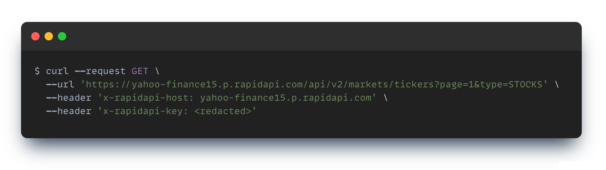

author: Zarin Lokhandwala
summary: Pittsburgh WITCON 2024
id: pittsburgh-witcon-2024
categories: Web
status: draft 
Feedback Link: https://zarin.io

# Pittsburgh WITCON 2024
<!-- ---------------------------------------------------------------------------------------------------------------- -->
## Overview
Duration: 1

### First Half
✅ Understanding HTTP
<br>✅ HTTP Request Lifecycle
<br>✅ Web Architecture Overview
<br>✅ HTTP Request Structure
<br>✅ HTTP Response Structure 
<br>✅ HTTP Request Example 
<br>✅ REST API 101
<br>✅ API Versioning
<br>✅ API Routes
<br>✅ API Security Concepts
<br>✅ API Consumption with Postman REST Client 🚀
### Second Half
✅ Spec Driven Development
<br>✅ Analyzing an API Spec
<br>✅ Power of AI
<br>✅ Workshop - Forge the Code 🧙🏼‍♀️🪄

### Software Utilized
- Download [Postman](https://www.postman.com/) 

<!-- ---------------------------------------------------------------------------------------------------------------- -->
## Understanding HTTP
Duration: 5

### What is HTTP? 
- HTTP (HyperText Transfer Protocol) is a stateless, communication protocol
- A protocol is a system of rules
- Stateless means each request is independent, and the server doesn't store session information
- An HTTP packet is a packet of data that carries information between client and server 
- The **S** at the end of HTTP**S**, stands for secured

<div style="display: flex;">
    
</div>

### HTTP Versions

- `HTTP/1.0`: Basic functionality with no persistence between requests.
- `HTTP/1.1`: Persistent connections, better caching, but still suffers from limitations like head-of-line blocking.
  - **Head-of-line** is when the first packet in a queue prevents other packets from being processed, creating a bottleneck
- `HTTP/2`: Major performance improvements with multiplexing and binary framing but still reliant on TCP.
- `HTTP/3`: Uses QUIC over UDP, eliminating head-of-line blocking and improving connection speed and reliability.
  - **Quick UDP Internet Connections** developed by Google runs over UDP and provides features similar to TCP

<!-- ---------------------------------------------------------------------------------------------------------------- -->
## HTTP Request Lifecycle
Duration: 1

<div style="display: flex;">
    
</div>

| **Key** | **Value** 
| --- | --- |
| DNS Lookup | Resolve domain names (i.e., website addresses) to IP addresses, a unique number that identifies a device connected to the internet. | 
| TCP 3-Way Handshake | Establishing a connection between client and server. | 
| HTTP Request | Client sends an HTTP request. | 
| HTTP Response | Server processes and returns the appropriate response. | 
| Connection Close | Connections can be set to persistent, therefore reused (i.e., closed by client), or one time connections (i.e., closed by server). | 

<!-- ---------------------------------------------------------------------------------------------------------------- -->
## Web Architecture Overview
Duration: 2

<div style="display: flex;">
    
</div>

### HTTP Request Flow

<div style="display: flex;">
    
</div>

| **Key** | **Value** 
| --- | --- |
| Content Delivery Network (CDN) | A middleman cache (i.e., proxy cache) between a user and a server, often close to the user geographically, that stores copies of website content to reduce latency and improve load times. | 
| Load Balancer | A device/software that distributes network traffic across multiple servers to improve efficiency and reliability. | 

<!-- ---------------------------------------------------------------------------------------------------------------- -->
## HTTP Request Structure
Duration: 5

<div style="display: flex;">
    
</div>

### URL Components

#### Base Syntax
```
https://www.wesellvehicles.com/vehicles/{make}/{model}?year={year}&exterior-color=navy&page-number=1&page-size=25

```
#### Example
```
https://www.wesellvehicles.com/vehicles/bmw/x3?year=2017&exterior-color=navy&page-number=1&page-size=25
```

1. Scheme / Protocol
- `https://`
- This specifies the protocol used for communication. It could be `http`, `https`, etc. `https` is secure and encrypted.

2. Host / Domain
- `www.wesellvehicles.com`
- This is the domain name of the server where the resource is located. It typically includes the subdomain (`www`), the second-level domain (`wesellvehicles`), and the top-level domain (`.com`).
  - Root Domain: `"."`
  - Top-Level Domains: `.edu`, `.org`, `.gov`, `.com`
  - Second-Level Domains: `khanacademy.org`, `microsoft.com` 
  - Third-Level Domains: `www.khanacademy.org`, `support.microsoft.com`

3. Path
- `/vehicles/bmw/x3`
- The path represents the specific resource or endpoint on the server you are trying to access.

4. Query Parameters
- `?year=2017&exterior-color=navy&page-number=1&page-size=25`
- The query string begins with `?` and contains key-value pairs separated by `&`. Each key-value pair provides parameters for the request:
  - `year=2017`: The year the vehicle was manufactured. 
  - `exterior-color=navy`: The exterior color of the vehicle. 
  - `page-number=1`: Provide the first page of results. 
  - `page-size=25`: Request to see 25 items per page of results. 
- The query parameters can be written in either format: 
  - camelCase, more common in JavaScript-based projects and is widely accepted in RESTful APIs or
	- Hyphens (`-`), common in static URLs, and useful for SEO-optimized URLs that need to be indexed by search engines.

⭐️ Bonus question: What port does HTTP communicate over? 

### HTTP Methods

Methods are ways to request data from servers. They are in the form of verbs. Often referred to as CRUD operations.  

| **Method** | **Usage** 
| --- | --- |
| `GET` | Get data from the server | 
| `POST` | Create a new resource on the server | 
| `PUT` | Update an existing resource on the server | 
| `DELETE` | Delete resource(s) on the server | 

### HTTP Request Headers

Imagine sending a letter through the postal service. The envelope is the part that has your address and the person’s address. That’s like the HTTP headers, which have information about where the message is going and how it’s being sent 

Common Request Headers:

- `Host`: Specifies the domain name of the server.
- `User-Agent`: Identifies the client software making the request (e.g., browser, app).
- `Accept`: Informs the server what content types the client is willing to accept.
- `Content-Type`: Specifies the media type of the body of the request when sending data (such as in a `POST` or `PUT` request).
- `Authorization`: Used to provide authentication credentials (e.g., a Bearer token for OAuth).

Example HTTP GET Request: 
```
GET /weather?city=San+Francisco HTTP/1.1
Host: api.weather.com
User-Agent: Mozilla/5.0 (Macintosh; Intel Mac OS X 10_15_7) AppleWebKit/605.1.15 (KHTML, like Gecko) Version/14.1 Safari/605.1.15
Accept: application/json
```

### HTTP Body Structure

The body of the letter is the actual message you are sending inside the envelope. It could be words, pictures, or anything you're trying to communicate.

The body carries the payload that the client is sending to the server. This might include data in the form of `JSON`, `XML`, plain text, a file upload, etc. 

Key points:
- Methods like `GET` *typically* have an empty body in requests, while `POST`, `PUT` *should* include a body.
- `Content-Type`: This header indicates the format of the body (e.g., `application/json`, `text/html`, etc.).
- `Content-Length`: This header specifies the size of the body in bytes.

<!-- ---------------------------------------------------------------------------------------------------------------- -->
## HTTP Response Structure
Duration: 3

<div style="display: flex;">
    
</div>

### Status Codes

HTTP status codes are short messages your web browser and websites use to talk to each other when you're browsing the internet. They tell your browser what happened when it tried to load a webpage.

Here's a breakdown of the main categories:

#### `1xx`: Information
These codes let your browser know the request is being processed, but there’s no final result yet. You rarely see these.

#### `2xx`: Success
Everything worked as expected!
- `200` OK: Standard success response for `GET` requests. 
- `201` Created: Typically returned by a `POST` request when a resource is successfully created.
- `204` No Content: The server successfully processed the request, but no content is returned, typically used when updating resources via `PUT` or removing resources via `DELETE`.

#### `3xx`: Redirection
These codes mean the website you're trying to reach is sending you somewhere else.
- `301` Moved Permanently: The requested resource has been assigned a new permanent URI, and future requests should use the new URI.
- `304` Not Modified: Used with conditional `GET` requests when the content hasn't changed since the last fetch. The server returns this response, so the client can use cached data.

#### `4xx`: Client Error
The problem is on your side (the browser or your request).
- `400` Bad Request: The server could not understand the request due to invalid syntax (e.g., malformed JSON or query parameters).
- `401` Unauthorized: The client has not passed in valid authentication credentials to access the resource. 
- `403` Forbidden: The client’s authentication is correct, but the client doesn't have permission to access the resource.
- `404` Not Found: The requested resource could not be found on the server. This could mean the URI is incorrect or the resource was deleted.

#### `5xx`: Server Error
These codes mean something went wrong on the website’s server.
- `500` Internal Server Error: A generic error message indicating something went wrong on the server.
- `502` Bad Gateway: The server was acting as a middleman server (i.e., proxy) and received an invalid response from the upstream server.
- `503` Service Unavailable: The server is currently unable to handle the request due to temporary overload or maintenance.
- `504` Gateway Timeout: Server did not receive a timely response from an upstream server.

### Response Headers and Body 

The response body is the part of the response where the actual content you’re looking for is sent back to you.

#### Headers

Example HTTP GET Response: 
```
HTTP/1.1 200 OK
Date: Tue, 15 Sep 2024 19:20:00 GMT
Content-Type: application/json; charset=utf-8
Content-Length: 354
Cache-Control: no-cache
ETag: "5f6cabc3-15e"
```

#### Body

```json
{
    "city": "San Francisco",
    "temperature": 18.7,
    "description": "Partly cloudy",
    "humidity": 77,
    "wind_speed": 5.2,
    "forecast": [
        {
            "day": "Wednesday",
            "high": 19.4,
            "low": 13.2,
            "description": "Mostly sunny"
        },
        {
            "day": "Thursday",
            "high": 20.1,
            "low": 14.0,
            "description": "Clear skies"
        }
    ]
}
```
Key Points: 
- When data is requested in `JSON` format, we should follow industry best practices.
- Considering that `JSON` stands for JavaScript Object Notation, the data payload found in the body of the response should be returned as an object, denoted by, `{ }`. 

Do:
- Envelope the data inside an object: 
```json
{
  data: [
    { ... },
    { ... }
  ]
}
```

Don't: 
- Return a top-level array: 
```text
[
  { ... },
  { ... }
]
```

<!-- ---------------------------------------------------------------------------------------------------------------- -->
## HTTP Request Example
Duration: 1

```bash
https://cat-fact.herokuapp.com/facts
```

<div style="display: flex;">
    
</div>

```bash
> GET /facts HTTP/1.1
> Host: cat-fact.herokuapp.com
> User-Agent: curl/8.7.1
> Accept: */*
```

<!-- ---------------------------------------------------------------------------------------------------------------- -->
## REST API 101
Duration: 3

### What is an API? 

- An **API** (Application Programming Interface) is a waiter in a restaurant.
- Customer (**client**) looks at the menu, tells the waiter the order (**request**). 
- Waiter takes your order to the kitchen (**the server**) and brings the food (**response**) back to you.
- You don’t need to know HOW the kitchen prepares the food. The waiter (**API**) simply delivers it.

### What is a RESTful API? 

- Options to order food: 
  - at the counter
  - via a drive-thru
  - through a mobile app
- No matter the method, same process, same food --> consistent == RESTful API 

### RESTful API Principles
#### 1. Uniform Interface
- Resources are manipulated via standardized URIs and representations (e.g., JSON, XML).
- The basic CRUD operations: `GET`, `POST`, `PUT`, `PATCH`, `DELETE`
- The URL is intuitive and points to a specific resource.
#### 2. Stateless
- Each request from the client to the server must contain all the necessary information for the server to understand and process it. The server does not store any client state between requests.
- Ex: When you place an order at the drive-thru, they don’t remember your previous orders.
#### 3. Cacheable
- Responses from the server must explicitly define whether they can be cached, and for how long. 
- Enables clients to reduce the number of requests they make to the server, improving performance.
#### 4. Client-Server
- The client is responsible for the user interface (UI) and request handling, while the server handles data storage and business logic. 
- Ex: The menu at the counter of Wendy's should appear the same to the customer even though the way it handles the requests to send to the kitchen have evolved. 
#### 5. Layered System
- Encourages intermediary layers such as load balancers, security layers, or caches between the client and server. 
- The client is unaware of these intermediary layers.
#### 6. Code on Demand (optional)

<!-- ---------------------------------------------------------------------------------------------------------------- -->
## API Versioning
Duration: 3

### Why Version an API?
- Backward Compatibility: Avoid breaking existing client applications when introducing new changes. 
- Adding / Removing Features: Phase in new features and phase out old functionality in a controlled manner.

### API Versioning Strategies

#### 1. URI Path Versioning
The version number is included directly in the URL path:
```bash
GET /api/v1/users/123   (version 1 of the API)
GET /api/v2/users/123   (version 2 of the API)
```

#### 2. Query Parameters Versioning
The version is passed as a query parameter in the request URL:
```bash
GET /api/users/123?version=1
GET /api/users/123?version=2
```

#### 3. Header Versioning
The version number is specified in the HTTP headers, usually under a custom header:
```bash
GET /api/users/123
Accept: application/vnd.myapi.v1+json   (version 1)
Accept: application/vnd.myapi.v2+json   (version 2)
```

#### 4. Embedded Versioning in Request/Response Body
The version number is embedded within the request or response body, instead of being part of the URL or headers:
```json
{
  "version": "1.0",
  "data": { ... }
}
```

Pros and Cons? 

### API Deprecation Policies
- Grace Period: Time the old version of an API is still available for after the new one is released. 
- Clear Deprecation Warnings: API responses often include headers or messages warning users when they’re using deprecated versions.
- Backward Compatibility: Ensuring older versions are compatible with existing clients as much as possible during the transition period.

#### Semantic Versioning
A versioning system that defines a structured, predictable format for assigning version numbers to software. 
```
MAJOR.MINOR.PATCH
```
Where:
- `MAJOR` version increments when there are incompatible changes that break backward compatibility.
- `MINOR` version increments when new features are added in a backward-compatible way.
- `PATCH` version increments when backward-compatible bug fixes are made.

Example:
```
4.1.2
```
- `4` is the `MAJOR` version, indicating potential breaking changes.
- `1` is the `MINOR` version, meaning new features have been added but no breaking changes.
- `2` is the `PATCH` version, indicating that only bug fixes or small updates have been made.

<!-- ---------------------------------------------------------------------------------------------------------------- -->
## API Routes
Duration: 3

Every resource in a RESTful API has its own URL (web address). 

| **Method** | **Route** | **Usage**
| --- | --- | --- |
| `GET` | `/menu` | Check the menu | 
| `GET` | `/orders/123` | Get the status of an order | 
| `POST` | `/orders` | Place an order | 
| `PUT` | `/orders/123` | Update an existing order | 
| `DELETE` | `/orders/123` | Cancel an order | 

How would I delete all the orders? 

### Key Points
- Use the plural of words to represent a collection (ex: `orders` vs `order`).
- `GET` can be used on a singular resource or a collection or resources. 
- `POST` should be used on an endpoint that represents a collection.

<!-- ---------------------------------------------------------------------------------------------------------------- -->
## API Security Concepts
Duration: 5

### 1. Authentication
Only authenticated users or systems can access the API (*you are who you say you are*). 
- **Basic Authentication**: Client supplies username and password in the API request.
- **API keys**: A simple, unique key provided to users to authenticate requests.
- **OAuth 2.0**: An open standard for authorization that allows third-party services to access resources on behalf of the user without exposing credentials.
  - Access tokens have a TTL (Time to Live) associated to them, which specifies how long is considered valid.

<div style="display: flex;">
    
</div>

- **OpenID Connect (OIDC)**: An authentication layer built on top of OAuth 2.0, allowing identity verification and single sign-on (SSO).
- **JWT (JSON Web Tokens)**: Encoded user data and includes a signature for verifying the authenticity of the token. Used for stateless authentication in APIs.

### 2. Authorization
After authentication, authorization determines what resources a user or system can access (*what do you have access to*).
- **Role-based access control (RBAC)**: Given a user's role, they are allowed certain operations.

### 3. Encryption
Encrypting data in transit (via `TLS/SSL`) to protectg against "man-in-the-middle" attacks. Encrypted sometimes at rest to ensure data is unreadable if obtained.

### 4. Rate Limiting and Throttling
Controls the number of requests a client can make in a specific time frame to prevent abuse (e.g., DoS - Denial of Service - attacks).

### 5. Data Validation and Sanitization
Ensures that input data is valid, properly formatted, and free from malicious content (like SQL injection).
- **HMAC (Hash-based Message Authentication Code)**: Ensures data integrity and authentication using cryptographic hashing and shared secret keys.

### 6. API Gateway
Acts as a proxy to manage, secure, and monitor API traffic.

### 7. Access Control
- **CORS (Cross-Origin Resource Sharing)**: Controls which external domains can interact with an API, protecting against unauthorized cross-origin requests.

<!-- ---------------------------------------------------------------------------------------------------------------- -->
## API Consumption with Postman REST Client 🚀
Duration: 10

We are going to consume an API using the `GET` method. 

Here are some good websites that will get you started when looking for free APIs to consume data from: 
- [Rapid API](https://rapidapi.com/hub)
- [GitHub Public APIs](https://github.com/public-apis/public-apis)

Let's take the following example: 

<div style="display: flex;">
    
    
</div>

| **Parameter** | **Value** 
| --- | --- | 
| Method | `GET` | Requesting resources | 
| Base URL | `https://yahoo-finance15.p.rapidapi.com` | 
| Path Parameters | `/api/v2/markets/tickers` | 
| Query Parameters | `page=1`, `type=STOCKS` | 
| Request Header | `x-rapidapi-host: yahoo-finance15.p.rapidapi.com` | 
| API Key sent via Request Header | `x-rapidapi-key: REDACTED` | 

<div style="display: flex;">
  
</div>

<!-- ---------------------------------------------------------------------------------------------------------------- -->
## Spec Driven Development
Duration: 3

Ideal software development occurs in two distinct phases:
1. The creation of a Spec
2. Development of code to match the Spec 

Spec Driven Development is the process of generating a concise spec that can be used to describe your application's interactions in a pragmatic way. In other words, the Spec is a blueprint for your application, detailing how the user interacts with it, rather than just expected behaviors/results. In order to be successful with Spec Driven Development, the Spec must be:
1. **Standardized**: Use of a standard Spec related to the type of application you are building 
2. **Consistent**: The Spec should remain consistent throughout in operations, utlizing consistent design patterns
3. **Tested**: Agile development of the Spec, incorporating repeated user feedback with long-term focus in mind 
4. **Concrete**: The creation of a complete, foundational Spec to be used for your application 
5. **Immutable**: Coding to the Spec without deviation 
6. **Persistent**: The Spec is not changed without strong reason and careful testing 

### Specs Available 

- [RAML](https://raml.org/)
- [API Blueprint](https://apiblueprint.org/)
- [Swagger](https://swagger.io/) (renamed to [OpenAPI Spec](https://github.com/OAI/OpenAPI-Specification))

We will be utilizing Swagger framework to design, produce, visualize, and consume our RESTful service. It provides a programming language-agnostic interface, which allows both humans and computers to discover and understand the capabilities of a service without requiring access to source code. 

<!-- ---------------------------------------------------------------------------------------------------------------- -->
## Analyzing an API Spec
Duration: 10

An OpenAPI spec is written in either `JSON` or `YAML`. We will be looking at a `YAML` spec for this demo. 

Use the online swagger editor 👉🏼 [editor.swagger.io](https://editor.swagger.io/) or [editor-next.swagger.io](https://editor-next.swagger.io/)

There will be a sample pre-populated, which we will further break down. 

For more docs, checkout: [Swagger.io Docs](https://swagger.io/docs/specification/about/) 

<!-- ---------------------------------------------------------------------------------------------------------------- -->
## Power of AI
Duration: 6

### Who is Allie K. Miller?
[Allie K. Miller](https://www.alliekmiller.com/) is a leading AI expert, previously the Global Head of Machine Learning for Startups and Venture Capital at AWS. She helped scale AI innovation worldwide and was the youngest woman to develop an AI product at IBM. A recognized voice in tech, she advocates for diversity in AI, co-founding **Girls of the Future** and serving as a national ambassador for  American Association for the Advancement of Science (AAAS). She holds an MBA from Wharton and frequently speaks on AI's future.

### Proof is in the Pudding

<a href="https://www.linkedin.com/embed/feed/update/urn:li:ugcPost:7235005812656467968">
  
</a>

<a href="https://www.linkedin.com/embed/feed/update/urn:li:ugcPost:7236449411118043136">
  
</a>

Follow her [LinkedIn posts](https://www.linkedin.com/in/alliekmiller/) by clicking on "Follow" to get *byte*-sized bits of information 🙂

<!-- ---------------------------------------------------------------------------------------------------------------- -->
## Workshop - Forge the Code 🧙🏼‍♀️🪄
Duration: 20

### Kickoff with a ChatGPT Prompt

Select the correct GPT model to start out with!

``` 
given the following API endpoint: https://yahoo-finance15.p.rapidapi.com/api/v2/markets/tickers?page=1&type=STOCKS

lets say i pass in header x-rapidapi-host = yahoo-finance15.p.rapidapi.com and an API key which is passed in as a header like x-rapidapi-key = 9e87a2c143msh6b923

which resulted in the following json object:

{"meta":{"version":"v1.0","status":200,"copywrite":"https://apicalls.io","totalrecords":7008,"headers":{"symbol":"Symbol","name":"Name","lastsale":"Last Sale","netchange":"Net Change","pctchange":"% Change","marketCap":"Market Cap"}},"body":[{"symbol":"ABBV","name":"AbbVie Inc. Common Stock","lastsale":"$193.51","netchange":"-0.32","pctchange":"-0.165%","marketCap":"341,805,178,095"},{"symbol":"ASML","name":"ASML Holding N.V. New York Registry Shares","lastsale":"$814.00","netchange":"10.50","pctchange":"1.307%","marketCap":"320,245,280,894"},{"symbol":"NFLX","name":"Netflix, Inc. Common Stock","lastsale":"$722.26","netchange":"16.89","pctchange":"2.394%","marketCap":"309,968,434,830"},{"symbol":"KO","name":"Coca-Cola Company (The) Common Stock","lastsale":"$71.33","netchange":"-0.40","pctchange":"-0.558%","marketCap":"307,422,895,140"},{"symbol":"BAC","name":"Bank of America Corporation Common Stock","lastsale":"$39.45","netchange":"-0.42","pctchange":"-1.053%","marketCap":"306,115,328,943"},{"symbol":"MRK","name":"Merck & Company, Inc. Common Stock (new)","lastsale":"$114.96","netchange":"-0.67","pctchange":"-0.579%","marketCap":"291,401,678,508"},{"symbol":"CVX","name":"Chevron Corporation Common Stock","lastsale":"$147.45","netchange":"-0.09","pctchange":"-0.061%","marketCap":"269,673,828,312"},{"symbol":"SAP","name":"SAP  SE ADS","lastsale":"$230.93","netchange":"0.49","pctchange":"0.213%","marketCap":"269,548,205,902"},{"symbol":"CRM","name":"Salesforce, Inc. Common Stock","lastsale":"$270.44","netchange":"6.23","pctchange":"2.358%","marketCap":"258,540,640,000"},{"symbol":"AMD","name":"Advanced Micro Devices, Inc. Common Stock","lastsale":"$158.32","netchange":"1.57","pctchange":"1.002%","marketCap":"256,238,045,700"},{"symbol":"TM","name":"Toyota Motor Corporation Common Stock","lastsale":"$183.53","netchange":"-1.87","pctchange":"-1.009%","marketCap":"247,291,479,267"},{"symbol":"AZN","name":"AstraZeneca PLC American Depositary Shares","lastsale":"$76.87","netchange":"-0.27","pctchange":"-0.35%","marketCap":"238,341,067,572"},{"symbol":"NVS","name":"Novartis AG Common Stock","lastsale":"$116.42","netchange":"0.05","pctchange":"0.043%","marketCap":"237,966,436,650"},{"symbol":"BABA","name":"Alibaba Group Holding Limited American Depositary Shares each representing eight Ordinary share","lastsale":"$97.19","netchange":"7.10","pctchange":"7.881%","marketCap":"236,525,556,155"},{"symbol":"TMUS","name":"T-Mobile US, Inc. Common Stock","lastsale":"$201.44","netchange":"-1.02","pctchange":"-0.504%","marketCap":"235,036,975,608"},{"symbol":"TMO","name":"Thermo Fisher Scientific Inc Common Stock","lastsale":"$611.88","netchange":"1.53","pctchange":"0.251%","marketCap":"233,735,446,924"},{"symbol":"PEP","name":"PepsiCo, Inc. Common Stock","lastsale":"$169.92","netchange":"-2.19","pctchange":"-1.272%","marketCap":"233,397,422,208"},{"symbol":"ADBE","name":"Adobe Inc. Common Stock","lastsale":"$524.07","netchange":"-3.80","pctchange":"-0.72%","marketCap":"232,372,638,000"},{"symbol":"LIN","name":"Linde plc Ordinary Shares","lastsale":"$479.35","netchange":"1.99","pctchange":"0.417%","marketCap":"228,890,936,981"},{"symbol":"CCZ","name":"Comcast Holdings ZONES","lastsale":"$58.89","netchange":"1.64","pctchange":"2.865%","marketCap":"228,051,620,578"},{"symbol":"SHEL","name":"Shell PLC American Depositary Shares (each representing two (2) Ordinary Shares) ","lastsale":"$69.41","netchange":"0.33","pctchange":"0.478%","marketCap":"217,305,988,853"},{"symbol":"MCD","name":"McDonald's Corporation Common Stock","lastsale":"$300.27","netchange":"1.21","pctchange":"0.405%","marketCap":"215,396,656,777"},{"symbol":"ACN","name":"Accenture plc Class A Ordinary Shares (Ireland)","lastsale":"$339.62","netchange":"0.41","pctchange":"0.121%","marketCap":"212,837,532,697"},{"symbol":"CSCO","name":"Cisco Systems, Inc. Common Stock (DE)","lastsale":"$52.52","netchange":"0.33","pctchange":"0.632%","marketCap":"209,593,391,381"},{"symbol":"GE","name":"GE Aerospace Common Stock","lastsale":"$189.66","netchange":"0.99","pctchange":"0.525%","marketCap":"205,650,427,295"}]}

can you create a RESTful API spec for me that creates the following endpoint: 

GET /stocks 

which takes in a query parameter named "page" that takes an integer and the result is the same object as seen above
```

Follow-up prompts: 
- Can you generate a spec that follows the OpenAPI standard, in `yaml` format?
- Can you modify the output object to be encompassed in another object called `response`? Then include a nested attribute called `statusCode` that takes the same value of `status` found in the `meta` object. 
- ...

### Enter Claude.ai

Claude AI is a family of AI models developed by Anthropic, a company founded by former OpenAI researchers. The model is named after Claude Shannon, the father of information theory.

Does require a paid subscription to take advantage of the "Use a project" functionality: [Claude.ai](https://claude.ai/)
- Allows you to create focused workspaces that organize conversations, documents, and knowledge around specific topics or tasks. 
- Great for collaboration! 

<div style="display: flex;">
  
</div>

Everything after this point will be done on the fly! Nothing prepped to mimic real-world scenario! 

<!-- ---------------------------------------------------------------------------------------------------------------- -->
## Thank you!
Duration: 1

<div style="display: flex;">
  
</div>

<div style="display: flex;">
  
  
</div>